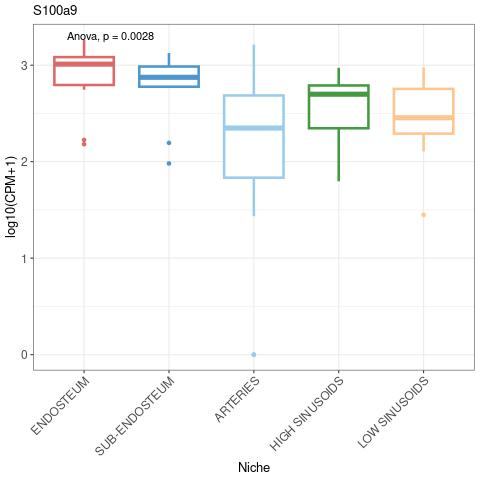
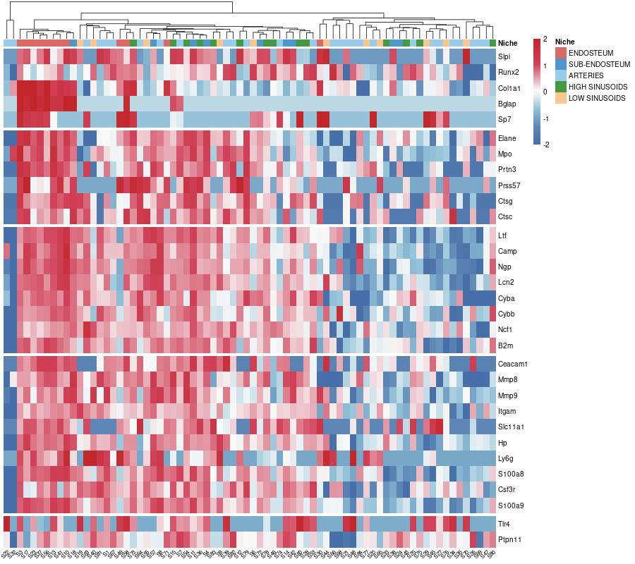
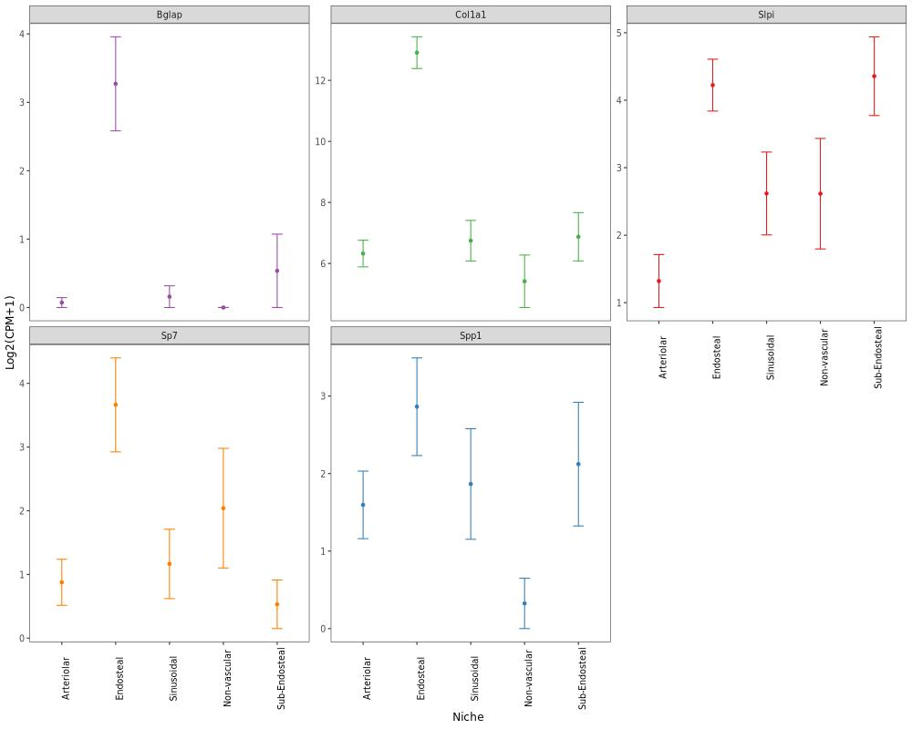
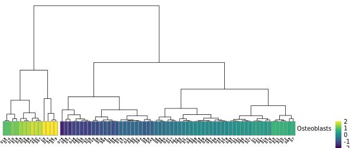
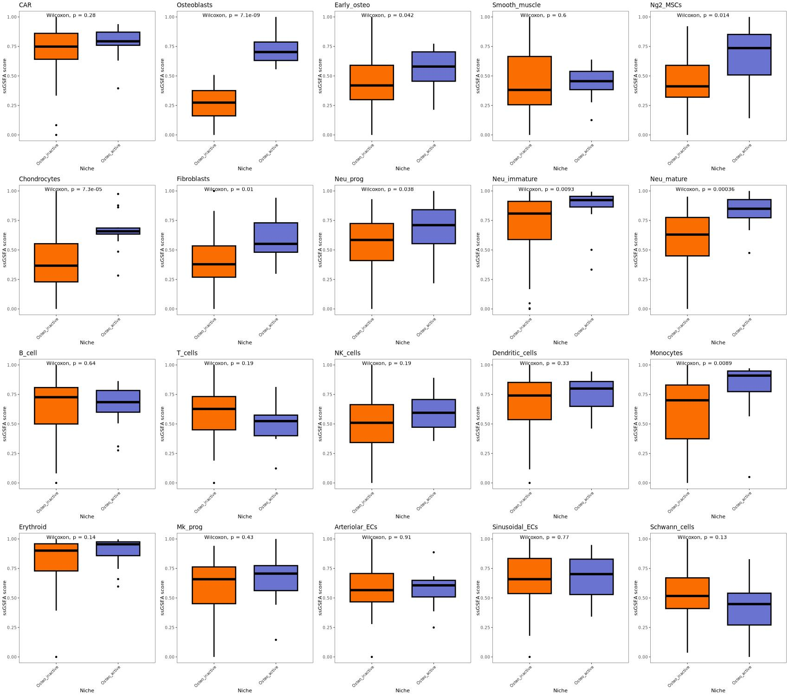
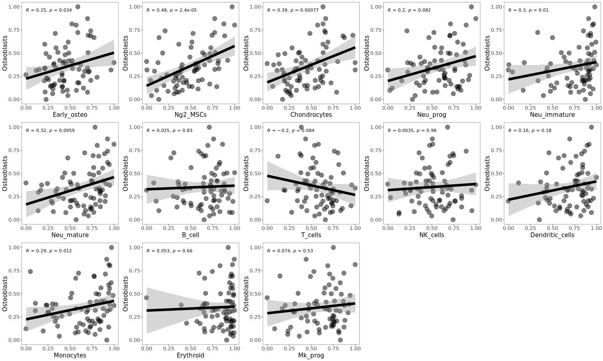
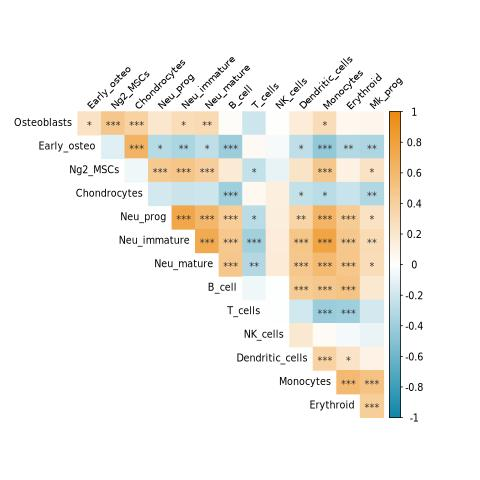
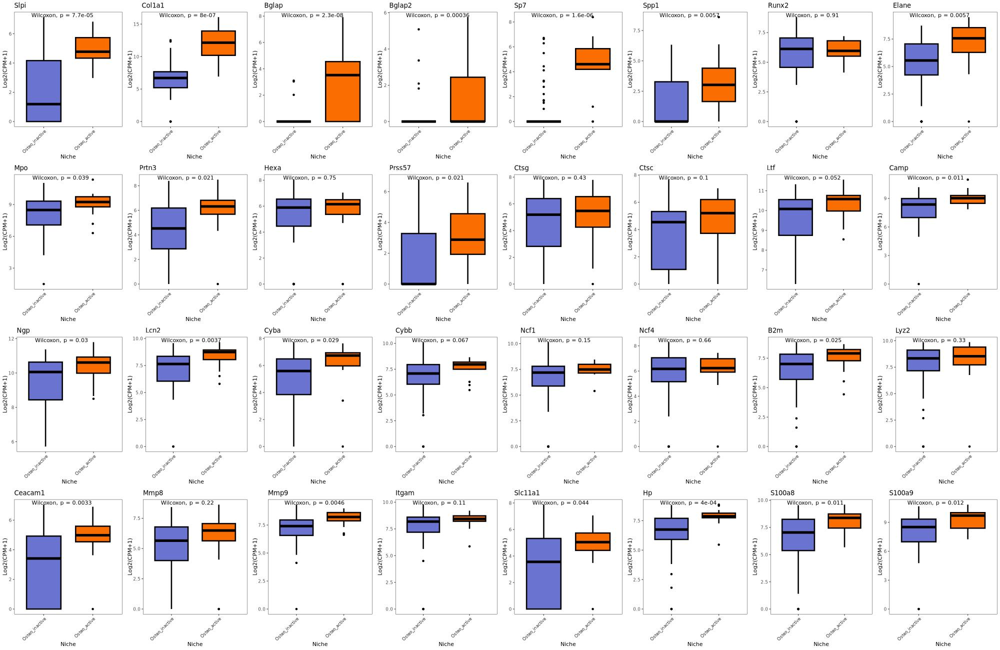
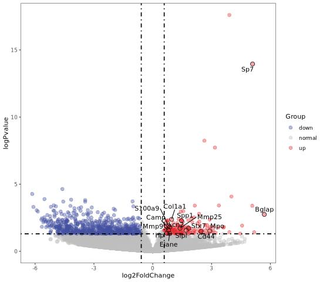

---
html:
    toc: true
    # number_sections: true # 标题开头加上编号
    toc_depth: 6
    toc_float:
        collapsed: false # 控制文档第一次打开时目录是否被折叠
        smooth_scroll: true # 控制页面滚动时，标题是否会随之变化
--- 

[TOC]


# 1. 数据导入
```r
library(dplyr)
library(patchwork)
library(ggplot2)
library(cowplot)
library(RColorBrewer)

set.seed(2)
rm(list=ls())
gc()

setwd("~/scRNA/Osteoblast_ST/GSE122464/")
```


- 读入数据
```r
load("./data/NicheDataLCM.rda")
load("./data/NicheMetaDataLCM.rda")

dim(NicheDataLCM)
#[1] 20753    76
dim(NicheMetaDataLCM)
#[1] 76 10


grep("S31|S50",colnames(NicheDataLCM))
#[1] 23 43

NicheDataLCM2 <- NicheDataLCM[,-c(23,43)]


grep("S31|S50",rownames(NicheMetaDataLCM))

NicheMetaDataLCM2 <- NicheMetaDataLCM[-c(23,43),]


##标准化表达矩阵                      
exprSet=log10(edgeR::cpm(NicheDataLCM2)+1)
```

&nbsp;
# 2. 箱线图
```r
features <- c("S100a9","Tlr4","Ptpn11","Col1a1","Stab1","Sema3g","Tnfrsf11a")


genes <- intersect(features,rownames(exprSet))
dat <- data.frame(t(exprSet[genes,]))
dat$Niche <- NicheMetaDataLCM2$`biological.class`


color2 <- c("#db6968","#4d97cd","#99cbeb","#459943","#fdc58f")

library(ggpubr)
library(Seurat)

grp <- "Niche"

grep("Ptprc",genes)

dat$Niche <- factor(dat$Niche,levels=c("ENDOSTEUM","SUB-ENDOSTEUM","ARTERIES","HIGH SINUSOIDS","LOW SINUSOIDS"))

for(i in 1:length(genes)){

    jpeg(paste("01-",i,"_",genes[i],".jpg",sep=""))
		boxplot=ggboxplot(dat[,c(grp,genes[i])],
                  x=grp,
                  y=genes[i],
                  color=grp,
                  palette = color2,
                  size=1.2) +
                theme_bw()+
                RotatedAxis() + 
                NoLegend() +
                labs(title =genes[i], x = grp,y="log10(CPM+1)",title.size = 50)+
                stat_compare_means(method = "anova")+
                #默认是wilcox.test，可换成t.test,kruskal.test，anova，下面同理
                theme(axis.text.x = element_text(size=12), axis.title.x = element_text(size=13), axis.text.y = element_text(size=12),axis.title.y = element_text(size=13))
    print(boxplot)
    dev.off()
}
```


&nbsp;

# 3. 热图
```r
library(pheatmap)

features <- c("Slpi","Runx2","Col1a1","Bglap","Sp7", #osteoblast
"Elane", "Mpo","Prtn3","Prss57","Ctsg","Ctsc", #Progenitor
"Ltf","Camp","Ngp","Lcn2","Cyba","Cybb","Ncf1","B2m", #immature
"Ceacam1","Mmp8","Mmp9","Itgam","Slc11a1","Hp","Ly6g",'S100a8',"Csf3r","S100a9",  #mature
"Tlr4","Ptpn11"
)

features <- c("Slpi","Runx2","Col1a1","Bglap","Sp7", #osteoblast
"Ctsk","Tnfrsf11a","Nfatc1","Fos","Csf1r",  # osteoclast
"Ptprc",
"Lyz2","Lgals3","Ly6c2","Cd14", # Mono
"Adgre1","Cd68","Mrc1","Marco",  #Macrophage
"Siglech","Itgax", #DC
"Cd3d","Cd3g","Cd3e","Cd8a","Ccl5","Lef1",#T 
"Ncam1","Nkg7","Klrb1c",#NK
"Cd79a","Cd79b" , #B
"Stab1","Stab2","Plvap","Sema3g","Jag1","Sox17"
)


features <- c("Slpi","Runx2","Col1a1","Bglap","Sp7", #osteoblast
"S100a9",  #mature
"Tlr4","Ptpn11"
)


genes <- intersect(features,rownames(exprSet))
dat <- exprSet[genes,]

dat3 <- dat[,intersect(colnames(dat),NicheMetaDataLCM2$id)]

match(colnames(dat3),NicheMetaDataLCM2$id)


Niche= NicheMetaDataLCM2$`biological.class`[match(colnames(dat3),NicheMetaDataLCM2$id)]
Niche= factor(Niche,levels=c("ENDOSTEUM","SUB-ENDOSTEUM","ARTERIES","HIGH SINUSOIDS","LOW SINUSOIDS"))

ann_col = data.frame(Niche= Niche)#创建分组列
 
row.names(ann_col) = colnames(dat3) 

ann_color = list(Niche = c("ENDOSTEUM"="#db6968","SUB-ENDOSTEUM"="#4d97cd", "ARTERIES"="#99cbeb","HIGH SINUSOIDS"="#459943", "LOW SINUSOIDS"="#fdc58f")) #定义分组颜色


bk <- c(seq(-2,-0.1,by=0.01),seq(0,2,by=0.01))


jpeg('02-1_htmp_neu.jpg',height=800,width=900)
pheatmap(dat3,
         scale = "row",
		 cluster_rows = FALSE,
		 cluster_cols= TRUE,
		 fontsize_col = 8,
         color = c(colorRampPalette(colors = c("#476FA9","#5D85B5","#8DBED6","#F9F9F9"))(length(bk)/2),colorRampPalette(colors = c("#F9F9F9","#D1425A","#C3262A"))(length(bk)/2)),
		 gaps_row=c(5,11,19,29),
         breaks=bk,
		 angle_col=45,
		 show_rownames = TRUE,
		 annotation_col = ann_col, #表示是否对行、列进行注释，默认NA
		 annotation_colors = ann_color,
		 #cellwidth = 30, 
		 #cellheight = 15,
		 border_color=NA)
dev.off()


jpeg('02-2_htmp_mye.jpg',height=800,width=900)
pheatmap(dat3,
         scale = "row",
		 cluster_rows = FALSE,
		 cluster_cols= TRUE,
		 fontsize_col = 8,
         color = c(colorRampPalette(colors = c("#476FA9","#5D85B5","#8DBED6","#F9F9F9"))(length(bk)/2),colorRampPalette(colors = c("#F9F9F9","#D1425A","#C3262A"))(length(bk)/2)),
		 gaps_row=c(5,10,11,15,19,21,27,30),
         breaks=bk,
		 angle_col=45,
		 show_rownames = TRUE,
		 annotation_col = ann_col, #表示是否对行、列进行注释，默认NA
		 annotation_colors = ann_color,
		 #cellwidth = 30, 
		 #cellheight = 15,
		 border_color=NA)
dev.off()
```


&nbsp;
# 4. ssGSEA
```r

library(dplyr)
library(patchwork)
library(ggplot2)
library(cowplot)
library(RColorBrewer)
library(ggpubr)

set.seed(2)
rm(list=ls())
gc()

setwd("/home/luchun/scRNA/Osteoblast_ST/GSE122464/01_Score/")


color.vector <- c(brewer.pal(8, "Set1"), brewer.pal(12, "Set3"), brewer.pal(8, "Dark2"), brewer.pal(8, "Accent"))
```
- 读入数据
```r

load("../data/NicheDataLCM.rda")
load("../data/NicheMetaDataLCM.rda")

dim(NicheDataLCM)
#[1] 20753    76
grep("S31|S50",colnames(NicheDataLCM))
#[1] 23 43

NicheDataLCM2 <- NicheDataLCM[,-c(23,43)]


dim(NicheMetaDataLCM)
#[1] 76 10

grep("S31|S50",rownames(NicheMetaDataLCM))

NicheMetaDataLCM2 <- NicheMetaDataLCM[-c(23,43),]

##标准化表达矩阵                      
exprSet=log2(edgeR::cpm(NicheDataLCM2)+1)
```

## 4.1 基因表达量箱线图
```r
genes <- c("Slpi","Spp1","Col1a1","Bglap","Sp7")
dat <- data.frame()

for(i in genes){
	dat1 <- data.frame(ID=NicheMetaDataLCM2$id,SampleClass=NicheMetaDataLCM2$`biological.class`,Gene=i,Exp=exprSet[i,])
	dat <- rbind(dat,dat1)
}

labeler <- c("ARTERIES" = "Arteriolar", "ENDOSTEUM" = "Endosteal", "HIGH SINUSOIDS" = "Sinusoidal", "LOW SINUSOIDS" = "Non-vascular", "SUB-ENDOSTEUM" = "Sub-Endosteal", "Other" = "darkgrey")

color <- color.vector[1:length(genes)]
names(color) <- genes


jpeg("01-1_boxplot.jpg",width=1000,height=800)
ggplot(aes(x = SampleClass, y= Exp ,color = Gene),data=dat) + geom_point(stat="summary", fun.y=mean) + 
  #stat_compare_means(method = "anova")+
  facet_wrap(~ Gene, scales="free_y") + 
  theme_bw(base_size=12) + 
  theme(axis.text.x = element_text(angle=90, color="black"), panel.grid = element_blank()) + 
  geom_errorbar(stat="summary", fun.ymin=function(x) mean(x)+sd(x)/sqrt(length(x)),fun.ymax=function(x) mean(x)-sd(x)/sqrt(length(x)), width=0.2) + 
  ylab("Log2(CPM+1)") + 
  scale_color_manual(values = color, guide=F) + 
  xlab("Niche") + 
  scale_x_discrete(labels = labeler)
dev.off()
```


## 4.2 ssGSEA基因导入
```r
CAR <- c("Cxcl12","Kitl",'Hp','Lpl','Tmem176a','H2-D1','Apoe')
Osteoblasts <- c("Slpi","Col1a1","Bglap","Bglap2","Sp7","Spp1","Runx2") 
Early_osteo <- c("Prg4","Cytl1","Gas1","Mn1","Vwa1","Sox5","Trps1","Sox9","Nid2","Fxyd2","Col2a1","Acan","Sp7") 
Smooth_muscle <- c("Myh11","Acta2",'Sparcl1','Dstn','Myl9','Tagln')
Ng2_MSCs <- c('Cd63','Spp1','Serpine2','Tnc','Mmp13','Ibsp','Cfh')
Chondrocytes <- c('Col2a1',"Acan")
Fibroblasts <- c("Dcn","Col1a1","Ang",'S100a6','Ly6a','Mfap5','Clec3b','Fstl1','Pi16','Ly6c1','Timp2')

Neu_prog <- c("Elane", "Mpo","Prtn3",'Hexa','Prss57','Ctsg','Ctsc')
Neu_immature <- c("Ltf","Camp","Ngp","Lcn2",'Cyba','Cybb','Ncf1','Ncf4','B2m','Lyz2')
Neu_mature <- c('Ceacam1',"Mmp8","Mmp9",'Itgam','Slc11a1','Hp','Slpi') 

B_cell <- c("Cd79a","Cd79b","Ms4a1","Cd74")  
T_cells <- c("Cd3d","Cd3g","Cd3e","Ccl5","Lck")
NK_cells <- c("Ncam1","Nkg7","Klrb1c","Klrd1")
Dendritic_cells <- c("Siglech","Cd74")
Monocytes <- c("Csf1r",'Psap','Lgals3','Tyrobp','Ctss','Fcer1g','Tmsb4x','Alox5ap') 
Erythroid <- c("Tfrc","Hbb-bt","Gata1")
Mk_prog <- c("Itga2b",'Ctla2a','Rgs18','Nrgn','Pf4','Fam212a')

Arteriolar_ECs <- c("Cdh5","Ly6a",'Tm4sf1','Ly6c1','Slc9a3r2','Ly6e','Crip2','Cav1','Esam') 
Sinusoidal_ECs <- c("Cdh5","Emcn",'Sepp1','Gng11','Plvap','Cldn5','Tcn2','Egfl7','Esam','Fcgrt','Lrg1') 
Schwann_cells <- c("Mag","Mog",'Plp1','Aplp1','Mbp','Cldn11','Cnp','Stmn4','Tubb4a','Mal')


## test <- exprSet[intersect(rownames(exprSet),Osteoblasts),]
## write.csv(test,"test.csv",quote=FALSE)


features <- unique(c(CAR,Osteoblasts,Early_osteo,Smooth_muscle,Ng2_MSCs,Chondrocytes,Fibroblasts,Neu_prog,Neu_immature,Neu_mature,B_cell,T_cells,NK_cells,Dendritic_cells,Monocytes,Erythroid,Mk_prog,Arteriolar_ECs,Sinusoidal_ECs,Schwann_cells))

features %in% rownames(exprSet)

geneset <- list(CAR=CAR,Osteoblasts=Osteoblasts,Early_osteo=Early_osteo,Smooth_muscle=Smooth_muscle,Ng2_MSCs=Ng2_MSCs,Chondrocytes=Chondrocytes,Fibroblasts=Fibroblasts,Neu_prog=Neu_prog,Neu_immature=Neu_immature,Neu_mature=Neu_mature,B_cell=B_cell,T_cells=T_cells,NK_cells=NK_cells,Dendritic_cells=Dendritic_cells,Monocytes=Monocytes,Erythroid=Erythroid,Mk_prog=Mk_prog,Arteriolar_ECs=Arteriolar_ECs,Sinusoidal_ECs=Sinusoidal_ECs,Schwann_cells=Schwann_cells)
```

## 4.3 ssGSEA计算
```r
library(GSVA)
ssgsea <- gsva(expr = as.matrix(exprSet), 
                      gset.idx.list = geneset,
                      method = 'ssgsea',kcdf = 'Gaussian',abs.ranking = TRUE)


scale_gsva_matrix <- t(scale(t(ssgsea)))
#scale_gsva_matrix[scale_gsva_matrix< -2] <- -2
#scale_gsva_matrix[scale_gsva_matrix>2] <- 2

write.csv(ssgsea,"ssgsea.csv",quote=FALSE)
write.csv(scale_gsva_matrix,"scale_gsva.csv",quote=FALSE)
```

## 4.4 ssGSEA画图
### 4.4.1 利用原始ssgsea矩阵画热图
```r

color.vector <- c(brewer.pal(8, "Set1"), brewer.pal(12, "Set3"), brewer.pal(8, "Dark2"), brewer.pal(8, "Accent"))
color.vector[c(12:16,18)]


Niche= NicheMetaDataLCM2$`biological.class`[match(colnames(ssgsea),NicheMetaDataLCM2$id)]
Niche= factor(Niche,levels=c("ENDOSTEUM","SUB-ENDOSTEUM","ARTERIES","HIGH SINUSOIDS","LOW SINUSOIDS"))

annotation_col = data.frame(Niche= Niche)#创建分组列
row.names(annotation_col) = colnames(ssgsea) 

ann_color = list(Niche = c("ENDOSTEUM"="#a1d5b9","SUB-ENDOSTEUM"="#0eb0c8", "ARTERIES"="#f2ccac","HIGH SINUSOIDS"="#edd064", "LOW SINUSOIDS"="#e1abbc")) #定义分组颜色


ssgsea_osteoblast <- as.matrix(ssgsea["Osteoblasts",],nrow=1)
colnames(ssgsea_osteoblast) <- colnames(ssgsea)
rownames(ssgsea_osteoblast) <- "Osteoblasts"


bk <- c(seq(-2,-0.1,by=0.01),seq(0,2,by=0.01))

library(pheatmap)
library(viridis)

jpeg('01-2_htmp.jpg',height=250,width=600)
pheatmap(ssgsea_osteoblast,
					scale = "row",
                    show_colnames = TRUE,
                    cluster_rows =FALSE,cluster_cols = TRUE ,cutree_cols=2,
					#cellwidth = 8, cellheight = 15,
                    #annotation_col = annotation_col,
					#表示是否对行、列进行注释，默认NA
					#annotation_colors = ann_color,
                    #gaps_row = c(12,20)
					 fontsize_col = 6,
		 color = c(colorRampPalette(colors = c("#440154FF", "#443A83FF", "#31688EFF","#21908CFF"))(length(bk)/2),colorRampPalette(colors = c( "#21908CFF","#35B779FF","#8FD744FF","#FDE725FF"))(length(bk)/2)),
         breaks=bk,
		 angle_col=45,
		 treeheight_col =200,
		 border_color = "grey60")
dev.off()


pdf('01-2_htmp.pdf',height=3.646,width=8.75)
pheatmap(ssgsea_osteoblast,
					scale = "row",
                    show_colnames = TRUE,
                    cluster_rows =FALSE,cluster_cols = TRUE ,cutree_cols=2,
					#cellwidth = 8, cellheight = 15,
                    #annotation_col = annotation_col,
					#表示是否对行、列进行注释，默认NA
					#annotation_colors = ann_color,
                    #gaps_row = c(12,20)
					 fontsize_col = 6,
		 color = c(colorRampPalette(colors = c("#440154FF", "#443A83FF", "#31688EFF","#21908CFF"))(length(bk)/2),colorRampPalette(colors = c( "#21908CFF","#35B779FF","#8FD744FF","#FDE725FF"))(length(bk)/2)),
         breaks=bk,
		 angle_col=45,
		 treeheight_col =200,
		 border_color = "grey60")
dev.off()
```

### 4.4.2 利用0-1标准化ssgsea矩阵画箱线图
```r
dat <- data.frame(t(ssgsea))
dat.1 <- dat
for (i in colnames(dat)) {
  #i <- colnames(dat)[1]
  dat.1[,i] <- (dat[,i] -min(dat[,i]))/(max(dat[,i] )-min(dat[,i] ))
  
}

color2 = c("#6a73cf","#fa6e01")
```

```r
#导入Niche信息
library(ggpubr)
library(Seurat)
library(tidyr)

Niche = read.csv("Osteo_region.csv",header=TRUE)

dat.1$Niche <- factor(Niche$Region,levels=c("Osteo_inactive","Osteo_active"))

  
plot_list = list()
for(i in colnames(dat.1)[1:(ncol(dat.1)-1)]){
	plot_list[[i]] <- ggboxplot(dat.1[,c(i,"Niche")],
                  x="Niche",
                  y=i,
                  color="black",
				  fill="Niche",
                  palette = color2,size=1.2
                  ) +theme_bw()+
        theme(panel.grid=element_blank())+RotatedAxis() + NoLegend() +
		labs(title =i, x = "Niche",y="ssGSEA score")+stat_compare_means(method = "wilcox.test") #默认是wilcox.test，可换成t.test,kruskal.test，anova，下面同理	
}


library(cowplot)
jpeg("01-3_BoxPlot.jpg",width=1700,height=1500)
plot_grid(plotlist=plot_list,ncol=5)
dev.off()

pdf("01-3_BoxPlot.pdf",width=24.8,height=21.9)
plot_grid(plotlist=plot_list,ncol=5)
dev.off()
```

### 4.4.3 Correlation拟合曲线图
```r
dat <- data.frame(t(ssgsea))
# Min-Max标准化是指对原始数据进行线性变换，将值映射到[0，1]之间
dat.1 <- dat
for (i in colnames(dat)) {
  #i <- colnames(dat)[1]
  dat.1[,i] <- (dat[,i] -min(dat[,i]))/(max(dat[,i] )-min(dat[,i] ))
  
}
'''
dat.1$Niche <- factor(Niche$Region,levels=c("Osteo_inactive","Osteo_active"))

dat <- dat.1[which(dat.1$Niche == "Osteo_inactive"),]
'''

dat <- dat.1

library(ggplot2)
library(ggpubr)


y <- dat$Osteoblasts
outTab=data.frame()
plot_list = list()

for(j in colnames(dat)[c(3,5,6,8:17)]){
	x <- dat[,j]
	df1=as.data.frame(cbind(x,y))
	corT=cor.test(x,y,method="spearman")
	
	cor=corT$estimate
	pValue=corT$p.value

	plot_list[[j]] <- ggplot(df1, aes(x, y)) + 
		ylab("Osteoblasts")+xlab(j)+
		geom_point(size=5,shape=21,fill="black",colour="black",alpha = 0.5)+ geom_smooth(method="lm",formula=y~x,colour = "black",size = 3) + 
		theme_bw()+
        theme(panel.grid=element_blank())+
		stat_cor(method = 'spearman', aes(x =x, y =y))+
		# 调整横坐标刻度字体大小
  theme(axis.text.x = element_text(size = 13)) +
  # 调整横坐标轴标题字体大小
  theme(axis.title.x = element_text(size = 15)) +
  # 调整纵坐标刻度字体大小
  theme(axis.text.y = element_text(size = 13)) +
  # 调整纵坐标轴标题字体大小
  theme(axis.title.y = element_text(size = 15))
  
	outTab=rbind(outTab,cbind(Cell=j,pValue,cor))		
}
outTab

write.csv(outTab,file="Cor.result.csv",row.names=F,quote=F)


jpeg("01-5_corPlot.jpg",width=1500,height=900)
plot_grid(plotlist=plot_list,ncol=5)
dev.off()

pdf("01-5_corPlot.pdf",width=21.875,height=13.125)
plot_grid(plotlist=plot_list,ncol=5)
dev.off()
```

### 4.4.4 相关性热图
```r

library(psych)


dat <- read.csv("ssgsea.csv",header=TRUE,row.names=1)
dat2 <- data.frame(t(dat))[c(2,3,5,6,8:17)]


#自定义颜色；

mycol <-colorRampPalette(c( "#0f86a9", "white", "#ed8b10"))(200)


library(corrplot)

tdc <- cor(dat2, method="spearman")

#显著性计算：
testRes = cor.mtest(dat2, method="spearman",conf.level = 0.95)

#绘制上三角热图；
jpeg("01-6_cor_htmp.jpg")
corrplot(tdc, method = "color", 
			col = mycol, 
			tl.col = "black", 
			tl.cex = 0.8, 
			tl.srt = 45,
			#tl.pos = "lt",
            p.mat = testRes$p, 
			diag = F, 
			type = 'upper',
            sig.level = c(0.001, 0.01, 0.05), 
			pch.cex = 0.8,
            insig = 'label_sig', 
			pch.col = 'grey20', 
			order = 'original')
dev.off()		 

pdf("01-6_cor_htmp.pdf")
corrplot(tdc, method = "color", 
			col = mycol, 
			tl.col = "black", 
			tl.cex = 0.8, 
			tl.srt = 45,
			#tl.pos = "lt",
            p.mat = testRes$p, 
			diag = F, 
			type = 'upper',
            sig.level = c(0.001, 0.01, 0.05), 
			pch.cex = 0.8,
            insig = 'label_sig', 
			pch.col = 'grey20', 
			order = 'original')
dev.off()	
```


### 4.4.5 基因表达量箱线图
```r
genes <- unique(c(Osteoblasts,Neu_prog,Neu_immature,Neu_mature,"S100a8","S100a9"))
dat.1 <- data.frame(t(exprSet[genes,]))

dat.1$Niche <- factor(Niche$Region,levels=c("Osteo_inactive","Osteo_active"))

plot_list = list()
for(i in colnames(dat.1)[1:(ncol(dat.1)-1)]){
	plot_list[[i]] <- ggboxplot(dat.1[,c(i,"Niche")],
                  x="Niche",
                  y=i,
                  color="black",
				  fill="Niche",
                  palette = color2,size=1.2
                  ) +theme_bw()+
        theme(panel.grid=element_blank())+ RotatedAxis() + NoLegend() +
		labs(title =i, x = "Niche",y="Log2(CPM+1)")+stat_compare_means(method = "wilcox.test") #默认是wilcox.test，可换成t.test,kruskal.test，anova，下面同理	
}


library(cowplot)
jpeg("01-4_BoxPlot.jpg",width=2000,height=1300)
plot_grid(plotlist=plot_list,ncol=8)
dev.off()


pdf("01-4_BoxPlot.pdf",width=29.17,height=18.96)
plot_grid(plotlist=plot_list,ncol=8)
dev.off()
```


&nbsp;
# 5. 活跃区vs非活跃区差异表达分析
```r

library(dplyr)
library(patchwork)
library(ggplot2)
library(cowplot)
library(RColorBrewer)

set.seed(2)
rm(list=ls())
gc()

setwd("~/scRNA/Osteoblast_ST/GSE122464/01_Score/")
```
## 5.1 导入数据
```r
load("../data/NicheDataLCM.rda")
load("../data/NicheMetaDataLCM.rda")

dim(NicheDataLCM)
#[1] 20753    76
dim(NicheMetaDataLCM)
#[1] 76 10


grep("S31|S50",colnames(NicheDataLCM))
#[1] 23 43

NicheDataLCM2 <- NicheDataLCM[,-c(23,43)]


grep("S31|S50",rownames(NicheMetaDataLCM))

NicheMetaDataLCM2 <- NicheMetaDataLCM[-c(23,43),]


# 获取分组信息
Niche = read.csv("Osteo_region.csv",header=TRUE)

exprSet <- NicheDataLCM2
dim(exprSet)
#[1] 20753    74

group_list <- Niche$Region[match(colnames(exprSet),Niche$IDs)]
##factor很重要，实验组在后
group_list <- factor(group_list,levels=c("Osteo_inactive","Osteo_active"))
```

## 5.2 运行
```r

library(pheatmap)

#pheatmap(cor(exprSet))

batch=factor(NicheMetaDataLCM2$`batch.slide`)
batch
dat=log2(edgeR::cpm(exprSet)+1)


ht_for_RNAcounts <- function(dat){
  dat[1:4,1:4] 
  colnames(dat)
  ac=data.frame(group=group_list,
                batch=batch)
  rownames(ac)=colnames(dat)
  pheatmap(cor(dat),annotation_col = ac)
}

jpeg("02-1_cor_BM.jpg",width=530)
ht_for_RNAcounts(dat)
dev.off()


library(DESeq2)  
colData <- data.frame(row.names=colnames(exprSet), 
                       group_list=group_list) 
					   
dds <- DESeqDataSetFromMatrix(countData = exprSet,
                              colData = colData,
                              design = ~ group_list)
							  
dds <- DESeq(dds)
resultsNames(dds)

```

## 5.3 结果导出
```r

####################################################
#colData(airway)$dex
res <- results(dds, name=  "group_list_Osteo_active_vs_Osteo_inactive")
summary(res)

saveRDS(res, 'group_list_Osteo_active_vs_Osteo_inactive.rds')


resOrdered <- res[order(res$padj),]
DEG =as.data.frame(resOrdered)
rm_batch_deg = na.omit(DEG)  
head(rm_batch_deg)

write.csv(rm_batch_deg,"Osteo_active_vs_Osteo_inactive.csv",quote=FALSE)


# 筛选上下调，设定阈值
fc_cutoff <- 1
fdr <- 0.05 
rm_batch_deg$regulated <- "normal" 


loc_up <- intersect(which(rm_batch_deg$log2FoldChange>log2(fc_cutoff)),which(rm_batch_deg$padj<fdr))
loc_down <- intersect(which(rm_batch_deg$log2FoldChange< (-log2(fc_cutoff))),which(rm_batch_deg$padj<fdr))

rm_batch_deg$regulated[loc_up] <- "up"
rm_batch_deg$regulated[loc_down] <- "down" 
table(rm_batch_deg$regulated)
rm_batch_deg$ENSEMBL = rownames(rm_batch_deg)


write.csv(rm_batch_deg,"ENDOSTEUM.csv",quote=FALSE)

library(openxlsx)
write.xlsx(rm_batch_deg,"ENDOSTEUM.xlsx",rowNames=TRUE,colNames=TRUE)
```

## 5.4 火山图
```r

setwd("/home/luchun/scRNA/Osteoblast_ST/GSE122464/")
# 加载ggpubr包
library(ggpubr)
library(ggthemes)

rm(list=ls())
gc()


# 读取数据
deg.data <- read.csv("Osteo_active_vs_Osteo_inactive.csv", header = T,row.names=1)
```

- 5.4.1 数据整理
```r
deg.data$gene <- rownames(deg.data) 
head(deg.data)

deg.data$logPvalue <- -log10(deg.data$pvalue)    

#ggscatter(deg.data, x = "log2FoldChange", y = "logFDR") + theme_base()  

# 新加一列Group
deg.data$Group = "normal"

# 将FDR小于0.05，logFC小于1的基因设为显著下调基因
deg.data$Group[which( (deg.data$logPvalue > -log10(0.05)) & (deg.data$log2FoldChange > log2(1.5)) )] = "up"
deg.data$Group[which( (deg.data$logPvalue > -log10(0.05))  & (deg.data$log2FoldChange < -log2(1.5) ) )] = "down"
# 查看上调和下调基因数目
table(deg.data$Group)

#  down normal     up
#   3156   7067   4028
  
# 新加一列Label为需要标记的基因
deg.data$Label = ""
# 对差异表达基因的logPvalue值进行从小到大排序
deg.data <- deg.data[order(deg.data$logPvalue), ]

genes <- unique(c('Elane', 'Hp', 'Cd44', 'Mpo', 'Slpi', 'Mmp9', 'Stx7', 'Mmp25', 'Lcn2', 'Camp', 'S100a9',"Slpi","Spp1","Col1a1","Bglap","Sp7"))

for_label1 <- deg.data[which(deg.data$Group == "up" & deg.data$gene %in% genes),] 
for_label2 <- deg.data[which(deg.data$Group == "down" & deg.data$gene %in% genes),] 

for_label <- rbind(for_label1,for_label2)
```

```r

p <- ggplot(data = deg.data, 
            aes(x = log2FoldChange, 
                y = logPvalue)) +
  geom_point(alpha=0.4, size=2.5, 
             aes(color=Group)) +
  scale_color_manual(values=c("#4552A0", "grey", "#E32D32"))+
  geom_vline(xintercept=c(-log2(1.5),log2(1.5)),lty=4,col="black",lwd=0.8) +
  geom_hline(yintercept = -log10(0.05),lty=4,col="black",lwd=0.8) +
  theme_bw()+
  theme(panel.grid=element_blank())+
  geom_point(size = 3, shape = 1, data = for_label) +
  ggrepel::geom_text_repel(
    aes(label = genes),
    data = for_label,
    color="black",
	max.overlaps=20
  )


# 2. 在当前路径下输出图片(pdf/png)
jpeg("06-1_volcano.jpg",width=550)
p
dev.off()


pdf("06-1_volcano.pdf",width=8)
p
dev.off()
```

