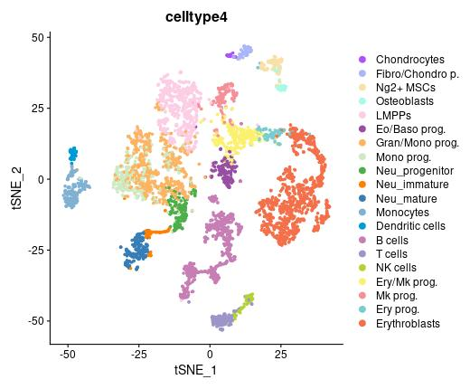
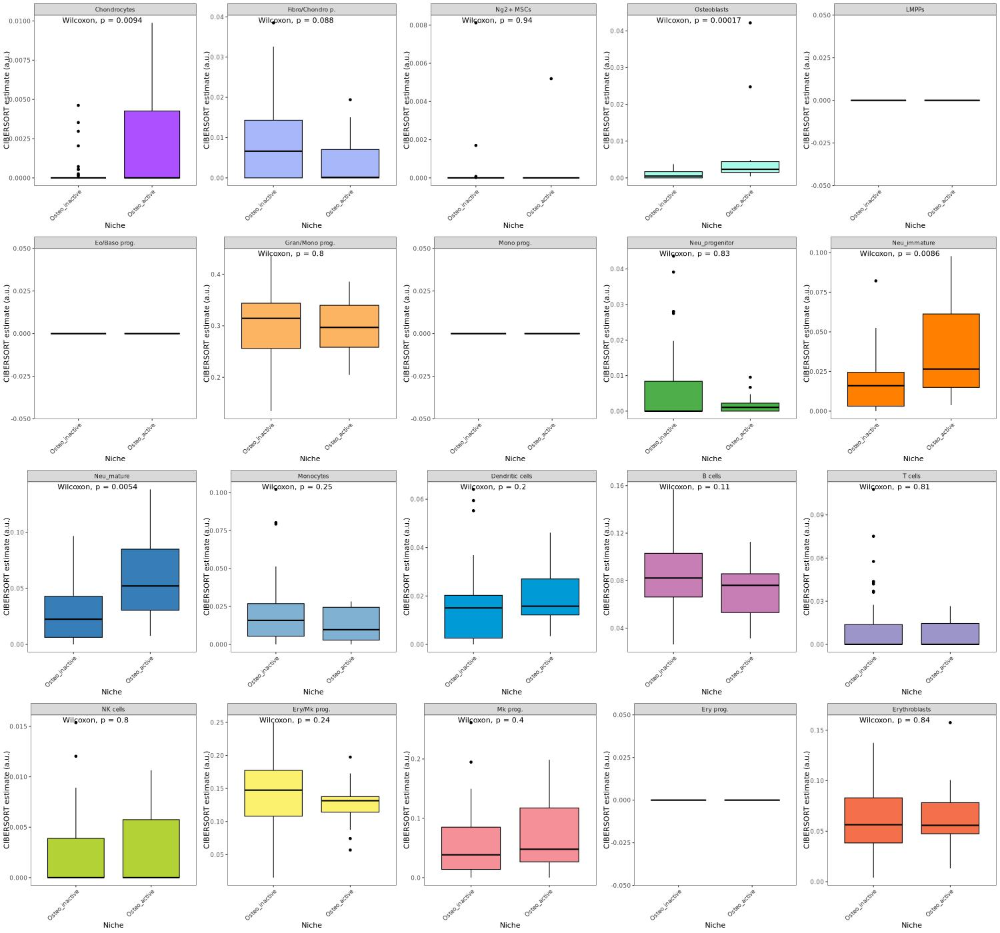
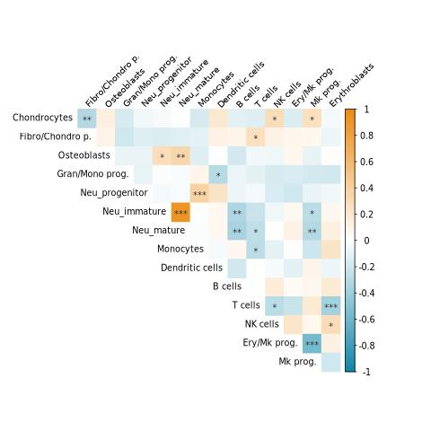
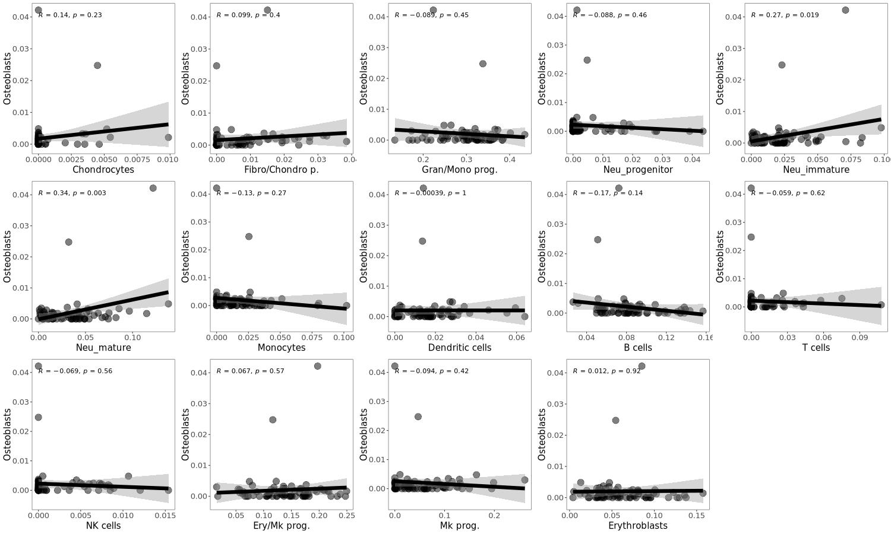

# 1. scRNA-seq数据分析
## 1.1 数据导入
```r
library(dplyr)
library(Seurat)
library(SeuratDisk)
library(patchwork)
library(ggplot2)
library(cowplot)
library(RColorBrewer)


set.seed(2)
rm(list=ls())
gc()

setwd("~/scRNA/Osteoblast_ST/GSE122464")


color.vector <- c(brewer.pal(8, "Set1"), brewer.pal(12, "Set3"), brewer.pal(8, "Dark2"), brewer.pal(8, "Accent"), brewer.pal(8, "Set2"),  brewer.pal(9, "Pastel1"),  brewer.pal(8, "Pastel2"))
color <- color.vector[c(9,11:16,18,19,21:30)]


load("./data/NicheData10x.rda")
load("./data/NicheMarkers10x.rda")
```

## 1.2 重新注释
```r

tsne <- DimPlot(NicheData10x, reduction = "tsne", group.by = "metadata....experiment..",pt.size=0.8,cols=color)	

jpeg("03-1_group.jpg",width=600)
tsne
dev.off()


PCs <- 1:16
NicheData10x <- FindNeighbors(NicheData10x, dims = PCs)
NicheData10x <- FindClusters(NicheData10x, graph.name = "RNA_snn", resolution = 5, algorithm = 1)

#设置不同的分辨率，观察分群效果(选择哪一个？)
for (res in c(0.8,1,1.2,1.4,1.6,1.8,2,2.2,2.4,2.6,2.8,3,3.2,3.4,3.6,3.8,4)) {
	NicheData10x <- FindClusters(NicheData10x, graph.name = "RNA_snn", resolution = res, algorithm = 1)
}


library(clustree) 
p2_tree <- clustree(NicheData10x@meta.data, prefix = "RNA_snn_res.")

jpeg("03-2_clustree.jpg",width=1000)
p2_tree 
dev.off()


res <- "RNA_snn_res.5"


genes_to_check <- unique(c('Ptprc','Lyz2','Itgal','Cklf','Lrp6','Tlr4','Il17a','Il19','Il1b','Il1r1','Il1r2','Il1rap','Il1rn','Cd44','Cxcr2','Ly6g','Elane', 'Mpo', 'Prtn3','Ltf', 'Camp','Lcn2','Cybb','Cyba','B2m','Mme', 'Mmp8', 'Mmp9', 'Hp','Slpi','Itgam','Ceacam1', 'Fn1', 'Ccr2', 'F13a1','S100a4','Ccl9','C1qa', 'Vcam1', 'Mrc1','Cd200r3', 'Mcpt8', 'Prss34','Cd3d','Ccl5', 
'Vpreb1','Ebf1','Ms4a4b','Cd79a', 'Cd79b','Cd19', 'Ighm','Jchain', 'Iglc2', 'Mzb1','Siglech', 'Irf8','Bst2','Hba-a1', 'Hbb-bs','Hbb-bt','Cd34', 'Adgrg1','Cdk6','Cxcl12', 'Col1a2', 'Lepr'))


dp <- DotPlot(NicheData10x, features = genes_to_check, assay = "RNA",cols=c("lightgrey","red"),dot.scale = 6, group.by = res) + 
	coord_flip() # + 
	#theme(axis.text.x = element_text(angle = 45, vjust = 0.5, hjust=0.5))
	
p <- DimPlot(NicheData10x, reduction = "tsne", group.by = res,cols = color.vector,label=TRUE,label.size=9,pt.size=0.8)

library(cowplot)
jpeg("03-3_DotPlot.jpg",width=2000,height=700)
plot_grid(dp,p,rel_widths = c(1.2,1))
dev.off()
```

```r
##进行注释	

celltype=data.frame(ClusterID=0:54,celltype='Undefined')

celltype[celltype$ClusterID %in% c(2,13,46),2]='Adipo-CAR'
celltype[celltype$ClusterID %in% c(47),2]='Osteo-CAR' 
celltype[celltype$ClusterID %in% c(50),2]='Osteoblasts' 
celltype[celltype$ClusterID %in% c(54),2]='Smooth muscle'
celltype[celltype$ClusterID %in% c(29),2]='Ng2+ MSCs'
celltype[celltype$ClusterID %in% c(53),2]='Chondrocytes'
celltype[celltype$ClusterID %in% c(43),2]='Fibro/Chondro p.'
celltype[celltype$ClusterID %in% c(31),2]='Stromal fibro.' 
celltype[celltype$ClusterID %in% c(1,38),2]='Arteriolar fibro.'
celltype[celltype$ClusterID %in% c(28,22,18),2]='Endosteal fibro.'
celltype[celltype$ClusterID %in% c(16,3),2]='Myofibroblasts'

 
celltype[celltype$ClusterID %in% c(8),2]='Neu_mature'
celltype[celltype$ClusterID %in% c(45),2]='Neu_immature'
celltype[celltype$ClusterID %in% c(7,52),2]='pro-B'
celltype[celltype$ClusterID %in% c(12),2]='small pre-B.'
celltype[celltype$ClusterID %in% c(24),2]='large pre-B.' 
celltype[celltype$ClusterID %in% c(41),2]='B cell'
celltype[celltype$ClusterID %in% c(23),2]='T cells'
celltype[celltype$ClusterID %in% c(42),2]='NK cells'
celltype[celltype$ClusterID %in% c(49),2]='Dendritic cells' 
celltype[celltype$ClusterID %in% c(35,32),2]='Monocytes'


celltype[celltype$ClusterID %in% c(14,27),2]='Ery/Mk prog.' 
celltype[celltype$ClusterID %in% c(15),2]='Mk prog.'
celltype[celltype$ClusterID %in% c(33),2]='Ery prog.'
celltype[celltype$ClusterID %in% c(20,51,44,25,26,48,4,9),2]='Erythroblasts'
celltype[celltype$ClusterID %in% c(40,0,5),2]='LMPPs'
celltype[celltype$ClusterID %in% c(21,37,10,6),2]='Gran/Mono prog.'
celltype[celltype$ClusterID %in% c(11),2]='Neu_progenitor'
celltype[celltype$ClusterID %in% c(19,34),2]='Mono prog.' 
celltype[celltype$ClusterID %in% c(17),2]='Eo/Baso prog.'


celltype[celltype$ClusterID %in% c(36),2]='Arteriolar ECs'
celltype[celltype$ClusterID %in% c(30),2]='Sinusoidal ECs' 
celltype[celltype$ClusterID %in% c(39),2]='Schwann cells'


NicheData10x@meta.data$celltype = "NA"
for(i in 1:nrow(celltype)){
  NicheData10x@meta.data[which(NicheData10x@meta.data$RNA_snn_res.5 == celltype$ClusterID[i]),'celltype'] <- celltype$celltype[i]
}

NicheData10x$celltype <- factor(NicheData10x$celltype,levels=c('Adipo-CAR','Osteo-CAR','Osteoblasts','Smooth muscle','Ng2+ MSCs','Chondrocytes','Fibro/Chondro p.','Stromal fibro.','Arteriolar fibro.','Endosteal fibro.','Myofibroblasts','Neu_progenitor','Neu_immature',"Neu_mature",'pro-B','small pre-B.','large pre-B.','B cell','T cells','NK cells','Dendritic cells','Monocytes','Ery/Mk prog.','Mk prog.','Ery prog.','Erythroblasts','LMPPs','Gran/Mono prog.','Mono prog.' ,'Eo/Baso prog.','Arteriolar ECs','Sinusoidal ECs','Schwann cells'))


table(NicheData10x$celltype)

color <- c(`Adipo-CAR`="#3ba889",`Osteo-CAR`="#ff0000",`Ng2+ MSCs`="#f9e0a7", Chondrocytes="#ab51ff",`Fibro/Chondro p.`="#a7b7f9",Osteoblasts="#a7f9e9",`Stromal fibro.`="#aed4e9",`Arteriolar fibro.`="#567fba",`Endosteal fibro.`="#f37633",Myofibroblasts="#dddddd",`Smooth muscle`="#ff2068",`Arteriolar ECs`="#b5a800",`Sinusoidal ECs`="#ffee00",`Gran/Mono prog.`="#FDB462",Neu_progenitor="#4DAF4A" ,Neu_immature="#FF7F00", Neu_mature="#377EB8",Neutrophils="#FDB462",Monocytes="#80B1D3",`Dendritic cells`="#009ad6",`small pre-B.`= "#f2ccac",`large pre-B.`="#edd064",`pro-B`="#e1abbc",`B cell`="#7b9696",`T cells`="#9b95c9",`NK cells`="#b2d235",`Ery/Mk prog.`="#fcf16e",`Mk prog.`="#f58f98",`Ery prog.`="#78cdd1",Erythroblasts="#f3704b",LMPPs="#FCCDE5",`Mono prog.`="#CCEBC5",`Eo/Baso prog.`="#984EA3",`Schwann cells`="#ff00fa")


tsne <- DimPlot(NicheData10x, reduction = "tsne", group.by = "celltype",pt.size=0.8,label=TRUE,label.size=3,cols=color)	


jpeg("03-4_celltype.jpg",width=700)
tsne
dev.off()


genes_to_check <- unique(c(
"Cxcl12","Kitl", ##CAR cell
"Spp1","Pdgfra","Eng","Nt5e","Thy1",  # Ng2+MSC  CD105 CD73 CD90
"Prg4","Cytl1","Gas1","Mn1","Vwa1","Sox5","Trps1", #root
"Sox9","Nid2","Fxyd2","Ccn6", ## Early_osteo
"Col2a1","Acan", ##Chondro
#"Spon2", "Igf1","Igfbp6","Ptn","Postn",  #Osteo
"Sp7","Bglap","Bglap2","Cadm1","Satb2","Car3",  #Osteo
"Col1a1",
"Dcn","Ang", #fibro
"Myh11","Acta2", ## Smooth
"Cdh5","Ly6a","Emcn",  #EC
"Ptprc",'Elane', 'Mpo', 'Prtn3','Ltf', 'Camp','Lcn2','Cybb','S100a8','S100a9','Mmp8', 'Mmp9', "Slpi",
"Csf1r", #monocyte
"Siglech",  #DC
"Cd79a","Vpreb1","Ebf1","Cd74",  #B
"Cd3g","Klrd1",
"Gata1","Itga2b", #Ery Mk
"Tfrc","Hbb-bt", #Ery
"Kit","Flt3", #HSPC
"Ms4a2", #Eo/Baso
"Mag","Mog"  #Schwann
))

dp <- DotPlot(NicheData10x, features = genes_to_check, cols=c("lightgrey","red"),scale.max = 50,dot.scale = 6, group.by = "celltype") + 
	coord_flip() + RotatedAxis()

library(cowplot)
jpeg("03-5_DotPlot.jpg",width=800,height=1200)
dp
dev.off()


jpeg("03-5_fp.jpg",height=600,width=1200)
FeaturePlot(NicheData10x,features=c("S100a9","Tlr4","Ager","Alcam",'Cd36','Cd68','Itgb2','Itgb2l'),reduction="tsne",cols=c("lightgrey","red"),pt.size=0.1,max.cutoff = "q95",ncol=4) & theme(legend.position = "right")
dev.off()


sce <- NicheData10x

sce$celltype2 <- as.vector(sce$celltype)
names(table(sce$celltype2))

index <- which(sce$celltype %in% c("Neu_immature",    "Neu_mature"))
sce$celltype2[index] <- "Neutrophils"


sce$celltype2 <- factor(sce$celltype2,levels=c('Adipo-CAR','Osteo-CAR','Ng2+ MSCs',
'Chondrocytes',
'Fibro/Chondro p.',"Osteoblasts",'Stromal fibro.','Arteriolar fibro.','Endosteal fibro.','Myofibroblasts','Smooth muscle','Arteriolar ECs','Sinusoidal ECs','LMPPs','Mono prog.' ,'Eo/Baso prog.','Gran/Mono prog.','Neu_progenitor','Neutrophils','Monocytes','Dendritic cells',"small pre-B.","large pre-B.","pro-B","B cell",'T cells','NK cells','Ery/Mk prog.','Mk prog.','Ery prog.','Erythroblasts','Schwann cells'))


p2 <- DimPlot(sce, reduction = "tsne", group.by = "celltype2",cols = color,pt.size=0.6,label=TRUE,label.size=3)


jpeg("03-5_celltype.jpg",width=700)
p2
dev.off()

pdf("03-5_celltype.pdf",width=10.21)
p2
dev.off()


genes_to_check <- unique(c(
"Cxcl12","Kitl", ##CAR cell
"Spp1","Pdgfra","Eng","Nt5e","Thy1",  # Ng2+MSC  CD105 CD73 CD90
"Prg4","Cytl1","Gas1","Mn1","Vwa1","Sox5","Trps1", #root
"Sox9","Nid2","Fxyd2","Ccn6", ## Early_osteo
"Col2a1","Acan", ##Chondro
#"Spon2", "Igf1","Igfbp6","Ptn","Postn",  #Osteo
"Sp7","Bglap","Bglap2","Cadm1","Satb2","Car3",  #Osteo
"Col1a1",
"Dcn","Ang", #fibro
"Myh11","Acta2", ## Smooth
"Cdh5","Ly6a","Emcn",  #EC
"Ptprc",'Elane', 'Mpo', 'Prtn3','Ltf', 'Camp','Lcn2','Cybb','Cyba','B2m','Mme', 'Mmp8', 'Mmp9', 'S100a8','S100a9',
"Csf1r", #monocyte
"Siglech",  #DC
"Cd79a","Vpreb1","Ebf1","Cd74",  #B
"Cd3g","Klrd1",
"Gata1","Itga2b", #Ery Mk
"Tfrc","Hbb-bt", #Ery
"Kit","Flt3", #HSPC
"Ms4a2", #Eo/Baso
"Mag","Mog"  #Schwann
))

dp <- DotPlot(sce, features = genes_to_check, cols=c("lightgrey","red"),scale.min = 5,scale.max = 50,dot.scale = 6, group.by = "celltype2") + 
	coord_flip() + RotatedAxis()

library(cowplot)
jpeg("03-6_DotPlot.jpg",width=800,height=1200)
dp
dev.off()

pdf("03-6_DotPlot.pdf",width=11.7,height=17.5)
dp
dev.off()
```

## 1.3 数据保存
```r

saveRDS(sce,"rds/01_NicheData10x.rds")
#sce <- readRDS("rds/01_NicheData10x.rds")

```

## 1.4 计算DEG
```r
library(EnsDb.Mmusculus.v79)
edb <- EnsDb.Mmusculus.v79
keys <- keys(edb, keytype="GENEID")
## Get the data
gene2sym <- select(edb, keys=keys, 
  columns=c("SYMBOL","ENTREZID","GENEBIOTYPE",'GENENAME'),
  keytype="GENEID")
table(gene2sym$GENEBIOTYPE)

ncRNA = gene2sym$SYMBOL[which(gene2sym$GENEBIOTYPE %in% c('lincRNA','miRNA','snRNA','snoRNA','piRNA','siRNA'))]
nofilter = sort(setdiff(rownames(sce),as.character(unique(c(rownames(sce)[grep('^mt-|^Rp|^Atp|^Hb[^(p)]',rownames(sce))],ncRNA)))))

length(nofilter)
#[1] 15809

sce2 <- subset(sce,features=nofilter)

Idents(sce2) <- "celltype"
levels(sce2)


marker <- FindAllMarkers(
		sce2, logfc.threshold = 0.25, min.pct = 0.1, #test.use = "roc"
	    test.use = "wilcox"
	)
	
write.csv(marker,"celltype_deg.csv",row.names=T)
```

## 1.5 取细胞子集
```r
library(dplyr)
library(Seurat)
library(SeuratDisk)
library(patchwork)
library(ggplot2)
library(cowplot)
library(RColorBrewer)


set.seed(2)
rm(list=ls())
gc()

setwd("~/scRNA/Osteoblast_ST/GSE122464")


color.vector <- c(brewer.pal(8, "Set1"), brewer.pal(12, "Set3"), brewer.pal(8, "Dark2"), brewer.pal(8, "Accent"), brewer.pal(8, "Set2"),  brewer.pal(9, "Pastel1"),  brewer.pal(8, "Pastel2"))


sce.all <- readRDS("rds/NicheData10x.rds")


sce <- subset(sce.all,subset= celltype2 %in% c("Adipo-CAR","Osteo-CAR","Stromal fibro.","Arteriolar fibro.","Endosteal fibro.","Myofibroblasts","Smooth muscle","Arteriolar ECs","Sinusoidal ECs","Schwann cells"),invert=TRUE)

```

## 1.6 重新降维聚类
```r

table(sce$celltype2)

sce$celltype3 <- as.vector(sce$celltype2)
index <- which(sce$celltype3 %in% c("small pre-B.","large pre-B.","pro-B","B cell"))
sce$celltype3[index] <- "B cells"

sce$celltype3 <- factor(sce$celltype3,levels=c('Chondrocytes','Fibro/Chondro p.','Ng2+ MSCs',"Osteoblasts",'LMPPs','Eo/Baso prog.','Gran/Mono prog.','Mono prog.' ,'Neu_progenitor','Neutrophils','Monocytes','Dendritic cells',"B cells",'T cells','NK cells','Ery/Mk prog.','Mk prog.','Ery prog.','Erythroblasts'))


sce$celltype4 <- as.vector(sce$celltype)
index <- which(sce$celltype4 %in% c("small pre-B.","large pre-B.","pro-B","B cell"))
sce$celltype4[index] <- "B cells"

sce$celltype4 <- factor(sce$celltype4,levels=c('Chondrocytes','Fibro/Chondro p.','Ng2+ MSCs',"Osteoblasts",'LMPPs','Eo/Baso prog.','Gran/Mono prog.','Mono prog.' ,'Neu_progenitor','Neu_immature','Neu_mature','Monocytes','Dendritic cells',"B cells",'T cells','NK cells','Ery/Mk prog.','Mk prog.','Ery prog.','Erythroblasts'))
```

```r


'''
sce <- SCTransform(sce,verbose = TRUE)  
sce <- RunPCA(sce,verbose = TRUE)

'''


sce <- NormalizeData(sce, normalization.method = "LogNormalize", scale.factor = 1e4)
sce <- FindVariableFeatures(sce, selection.method = "vst", nfeatures = 3000)
sce <- ScaleData(sce,features = rownames(sce))


sce <- RunPCA(sce, features = VariableFeatures(object = sce))

jpeg("04-1_elbow.jpg")
ElbowPlot(sce, ndims=50, reduction="pca") 
dev.off()


PCs <- 1:20
sce <- RunUMAP(sce, dims = PCs)
sce <- RunTSNE(sce, dims = PCs)


sce <- FindNeighbors(sce, dims = PCs)

#设置不同的分辨率，观察分群效果(选择哪一个？)
for (res in c(0.1,0.2,0.4,0.6,0.8,1,1.2,1.4,1.6)) {
	sce <- FindClusters(sce, graph.name = "SCT_snn", resolution = res)
}


library(clustree) 
p2_tree <- clustree(sce@meta.data, prefix = "SCT_snn_res.")

jpeg("04-2_clustree.jpg",width=1000)
p2_tree 
dev.off()


res <- "SCT_snn_res.1.6"

genes_to_check <- unique(c(
"Sox5", "Sox9",#root
"Col2a1","Acan", ##Chondro
"Dcn",  #Fibro
"Spp1","Pdgfra", # Ng2+MSC  CD105 CD73 CD90
#"Spon2", "Igf1","Igfbp6","Ptn","Postn",  #Osteo
"Sp7","Bglap","Bglap2","Cadm1","Satb2","Car3",  #Osteo
"Col1a1",
"Kit","Flt3", #HSPC
"Ptprc",
"Ms4a2", #Eo/Baso
'Elane', 'Mpo', 'Prtn3','Ltf', 'Camp','Lcn2','Cybb','S100a8','S100a9','Mmp8', 'Mmp9', "Slpi",
"Csf1r", #monocyte
"Siglech",  #DC
"Cd74", "Cd79a","Vpreb1","Ebf1", #B
"Cd3g","Klrd1",
"Itga2b","Gata1", #Ery Mk
"Tfrc","Hbb-bt" #Ery
))


dp <- DotPlot(sce, features = genes_to_check, assay = "RNA",cols=c("lightgrey","red"),dot.scale = 6, group.by = res) + 
	coord_flip()
	
p <- DimPlot(sce, reduction = "tsne", group.by = res,cols = color.vector,label=TRUE,label.size=9,pt.size=0.8)

library(cowplot)
jpeg("04-3_DotPlot.jpg",width=1200,height=500)
plot_grid(dp,p,rel_widths = c(1.2,1))
dev.off()


color <- c(Chondrocytes="#ab51ff",`Fibro/Chondro p.`="#a7b7f9",`Ng2+ MSCs`="#f9e0a7", Osteoblasts="#a7f9e9",LMPPs="#FCCDE5", `Eo/Baso prog.`="#984EA3",`Gran/Mono prog.`="#FDB462", `Mono prog.`="#CCEBC5", Neu_progenitor="#4DAF4A" ,Neu_immature="#FF7F00", Neu_mature="#377EB8",Monocytes="#80B1D3", `Dendritic cells`="#009ad6", `B cells`="#c77eb5",`T cells`= "#9b95c9",`NK cells`="#b2d235",`Ery/Mk prog.`= "#fcf16e", `Mk prog.`="#f58f98", `Ery prog.`="#78cdd1", Erythroblasts="#f3704b")


p <- DimPlot(sce, reduction = "tsne", pt.size=1,group.by = "celltype4",label = T,cols=color,label.size=3)

jpeg("04-4_celltype.jpg",height=430,width=520)
p
dev.off()

pdf("04-4_celltype.pdf",height=6.27,width=7.58)
p
dev.off()


p <- DimPlot(sce, reduction = "tsne", pt.size=1,group.by = "celltype4",label = FALSE,cols=color,label.size=3)

jpeg("04-5_celltype.jpg",height=430,width=520)
p
dev.off()

pdf("04-5_celltype.pdf",height=6.27,width=7.58)
p
dev.off()


dp <- DotPlot(sce, features = genes_to_check,assay = "RNA", cols=c("lightgrey","red"),dot.scale = 6, scale.min = 5,group.by = "celltype4") + 
	coord_flip() + RotatedAxis()

library(cowplot)
jpeg("04-6_DotPlot.jpg",width=600,height=800)
dp
dev.off()


pdf("04-6_DotPlot.pdf",width=8.75,height=11.67)
dp
dev.off()


scale.min = 5,scale.max = 50,


jpeg("04-5_vln.jpg",width=1000,height=500)
VlnPlot(sce,features=genes_to_check,group.by="celltype4",stack=TRUE,assay = "RNA",pt.size=0,fill.by = "ident",cols=color)
dev.off()


saveRDS(sce,"rds/02_NicheData10x.rds")


```



&nbsp;

# 2. Cibersort
## 2.1 导入数据
```r
library(data.table)
library(tidyr)
library(Seurat)
library(dplyr)
library(patchwork)
library(Matrix)
library(ggplot2)
set.seed(101)
library(RColorBrewer)
library(ggplot2)

rm(list=ls())
gc()

setwd("~/scRNA/Osteoblast_ST/GSE122464/02_CIBERSORT/")


########################################################

load("~/scRNA/Osteoblast_ST/GSE122464/data/NicheDataLCM.rda")
load("~/scRNA/Osteoblast_ST/GSE122464/data/NicheMetaDataLCM.rda")
#load("~/scRNA/Osteoblast_ST/GSE122464/data/NicheMarkers10x.rda")

NicheMarkers10x <- read.csv("~/scRNA/Osteoblast_ST/GSE122464/celltype_deg.csv",header=TRUE,row.names=1)

sce <- readRDS("~/scRNA/Osteoblast_ST/GSE122464/rds/02_NicheData10x.rds")
DefaultAssay(sce) <- "RNA"

Idents(sce) <- sce$celltype4
levels(sce)

```


## 2.2 查看样本情况
```r
## Unsupervised analysis
n.pca <- prcomp(t(DESeq2::varianceStabilizingTransformation(as.matrix(NicheDataLCM)) ))
qplot(x = n.pca$x[,1], y = n.pca$x[,2], color = NicheMetaDataLCM$biological.class) + scale_color_discrete(name="Sample type") + xlab("PC1") + ylab("PC2")
outliers <- n.pca$x[,1] > 70 | n.pca$x[,2] < -40
remove <- colnames(NicheDataLCM)[outliers]
#remove <- c("S31","S50")
```

## 2.3 反卷积
```r
usegenes <- unique(NicheMarkers10x$gene[(NicheMarkers10x$p_val_adj < 0.05 & abs(NicheMarkers10x$avg_log2FC) > 1 & NicheMarkers10x$cluster %in% c('Chondrocytes','Fibro/Chondro p.','Ng2+ MSCs',"Osteoblasts",'LMPPs','Eo/Baso prog.','Gran/Mono prog.','Mono prog.' ,'Neu_progenitor','Neu_immature','Neu_mature','Monocytes','Dendritic cells',"B cells",'T cells','NK cells','Ery/Mk prog.','Mk prog.','Ery prog.','Erythroblasts')) ])


mean_by_cluster <- do.call(cbind, lapply(unique(Idents(sce)), function(x) {
  apply(GetAssayData(sce, slot = "counts")[usegenes,colnames(sce)][,Idents(sce) == x], 1,mean )
}))
colnames(mean_by_cluster) <- unique(Idents(sce))


LCM_design <- NicheMetaDataLCM$biological.class
names(LCM_design) <- NicheMetaDataLCM$id

source("./CIBERSORT.R")

CIBER <- runCIBERSORT(NicheDataLCM, mean_by_cluster, LCM_design, mc.cores=8)

head(CIBER)
dim(CIBER)
#[1] 2508    4

write.csv(CIBER,"CIBER_raw.csv",quote=FALSE,row.names=FALSE)


CIBER <- subset(CIBER, !SampleID %in% remove)
write.csv(CIBER,"CIBER.csv",quote=FALSE,row.names=FALSE)
```

## 2.4 可视化
### 2.4.1 箱线图
```r
rm(list=ls())
gc()

CIBER <- read.csv("CIBER.csv",header=TRUE)

region <- read.csv("../01_Score/Osteo_region.csv",header=TRUE)
CIBER2 <- merge(CIBER, region, by = "SampleID")

write.csv(CIBER2,"CIBER2.csv",quote=FALSE,row.names=FALSE)

######
CIBER2 <- read.csv("CIBER2.csv",header=TRUE)


cell <- c('Chondrocytes','Fibro/Chondro p.','Ng2+ MSCs',"Osteoblasts",'LMPPs','Eo/Baso prog.','Gran/Mono prog.','Mono prog.' ,'Neu_progenitor','Neu_immature','Neu_mature','Monocytes','Dendritic cells','T cells','NK cells','Ery/Mk prog.','Mk prog.','Ery prog.','Erythroblasts')
dat <- CIBER2[CIBER2$CellType %in% cell,]


cell2 <- c("small pre-B.","large pre-B.","pro-B","B cell")
dat2 <- CIBER2[CIBER2$CellType %in% cell2,]


library(dplyr)
dat3 <- dat2 %>%
  group_by(SampleID) %>%
  summarise(Fraction = sum(Fraction))
dat3$CellType <- "B cells"


dat4 <- merge(unique(dat[,c(1,4,5)]), dat3, by = "SampleID")


merged_dat <- rbind(dat,dat4[,c(1,5,4,2,3)])


CIBER2 <- merged_dat
library(ggpubr)

CIBER2$CellType <- factor(CIBER2$CellType,levels=c('Chondrocytes','Fibro/Chondro p.','Ng2+ MSCs',"Osteoblasts",'LMPPs','Eo/Baso prog.','Gran/Mono prog.','Mono prog.' ,'Neu_progenitor','Neu_immature','Neu_mature','Monocytes','Dendritic cells',"B cells",'T cells','NK cells','Ery/Mk prog.','Mk prog.','Ery prog.','Erythroblasts'))
CIBER2$SampleClass <- factor(CIBER2$SampleClass,levels=c("ENDOSTEUM","SUB-ENDOSTEUM","ARTERIES", "LOW SINUSOIDS","HIGH SINUSOIDS"))
CIBER2$Region <- factor(CIBER2$Region,levels=c("Osteo_inactive","Osteo_active"))

color <- c(`Adipo-CAR`="#3ba889",`Osteo-CAR`="#ff0000",`Ng2+ MSCs`="#f9e0a7", Chondrocytes="#ab51ff",`Fibro/Chondro p.`="#a7b7f9",Osteoblasts="#a7f9e9",`Stromal fibro.`="#aed4e9",`Arteriolar fibro.`="#567fba",`Endosteal fibro.`="#f37633",Myofibroblasts="#dddddd",`Smooth muscle`="#ff2068",`Arteriolar ECs`="#b5a800",`Sinusoidal ECs`="#ffee00",`Gran/Mono prog.`="#FDB462",Neu_progenitor="#4DAF4A" ,Neu_immature="#FF7F00", Neu_mature="#377EB8",Neutrophils="#FDB462",Monocytes="#80B1D3",`Dendritic cells`="#009ad6",`small pre-B.`= "#f2ccac",`large pre-B.`="#edd064",`pro-B`="#e1abbc",`B cell`="#7b9696",`B cells`="#c77eb5",`T cells`="#9b95c9",`NK cells`="#b2d235",`Ery/Mk prog.`="#fcf16e",`Mk prog.`="#f58f98",`Ery prog.`="#78cdd1",Erythroblasts="#f3704b",LMPPs="#FCCDE5",`Mono prog.`="#CCEBC5",`Eo/Baso prog.`="#984EA3",`Schwann cells`="#ff00fa")

labeler <- c("ENDOSTEUM" = "Endosteal", "SUB-ENDOSTEUM" = "Sub-Endosteal","ARTERIES" = "Arteriolar", "LOW SINUSOIDS" = "Non-vascular", "HIGH SINUSOIDS" = "Sinusoidal",   "Other" = "darkgrey")


plot_list <- list()

for (i in levels(CIBER2$CellType)) {
	p <- ggplot(aes(x = Region, y= Fraction,color = "black",fill=CellType),data=CIBER2[CIBER2$CellType==i,]) + 
	geom_boxplot() +  
	facet_wrap(~ CellType, scales="free_y") + 
	theme_bw()+
    theme(panel.grid=element_blank())+
	ylab("CIBERSORT estimate (a.u.)") + 
	scale_color_manual(values = "black", guide=F) + 
	scale_fill_manual(values = color, guide=F) + 
	xlab("Niche") + 
	scale_x_discrete(labels = labeler)+
	RotatedAxis()
	
	plot_list[[i]] <- p

} 
#install.packages("ggpval")
library(ggpval)

plot_list2 <- list()

for(i in levels(CIBER2$CellType)){
	p <- plot_list[[i]]+stat_compare_means(method = "wilcox.test")
	plot_list2[[i]] <- p
}


library(cowplot)
jpeg("05-5_cibersort.jpg",width=1500,height=1400)
plot_grid(plotlist=plot_list2,ncol=5)
dev.off()

pdf("05-5_cibersort.pdf",width=21.875,height=20.42)
plot_grid(plotlist=plot_list2,ncol=5)
dev.off()


pdf("05-6_cibersort.pdf",width=14.6,height=11.125)
ggplot(aes(x = Region, y= Fraction,color = CellType),data=CIBER2) + geom_point(stat="summary", fun.y=mean) + 
  #stat_compare_means(method = "anova")+
  facet_wrap(~ CellType, scales="free_y") + 
  theme_bw(base_size=12) + 
  theme(axis.text.x = element_text(angle=90, color="black"), panel.grid = element_blank()) + 
  geom_errorbar(stat="summary", fun.ymin=function(x) mean(x)+sd(x)/sqrt(length(x)),fun.ymax=function(x) mean(x)-sd(x)/sqrt(length(x)), width=0.2,size=1) + 
  ylab("CIBERSORT estimate (a.u.)") + 
  scale_color_manual(values = color, guide=F) + 
  xlab("Niche") + 
  scale_x_discrete(labels = labeler)
dev.off()

```


### 2.4.2 相关性热图
```r
dat <- spread(CIBER2[,1:3],CellType,Fraction)
dat2 <- dat[,-c(1,4,6,7,9,20)]

#自定义颜色；

mycol <-colorRampPalette(c( "#0f86a9", "white", "#ed8b10"))(200)


library(corrplot)

tdc <- cor(dat2, method="pearson")

#显著性计算：
testRes = cor.mtest(dat2, method="pearson",conf.level = 0.95)

#绘制上三角热图；
jpeg("05-7_cor_htmp.jpg")
corrplot(tdc, method = "color", 
			col = mycol, 
			tl.col = "black", 
			tl.cex = 0.8, 
			tl.srt = 45,
			#tl.pos = "lt",
            p.mat = testRes$p, 
			diag = F, 
			type = 'upper',
            sig.level = c(0.001, 0.01, 0.05), 
			pch.cex = 0.8,
            insig = 'label_sig', 
			pch.col = 'grey20', 
			order = 'original')
dev.off()		 

#绘制上三角热图；
pdf("05-7_cor_htmp.pdf")
corrplot(tdc, method = "color", 
			col = mycol, 
			tl.col = "black", 
			tl.cex = 0.8, 
			tl.srt = 45,
			#tl.pos = "lt",
            p.mat = testRes$p, 
			diag = F, 
			type = 'upper',
            sig.level = c(0.001, 0.01, 0.05), 
			pch.cex = 0.8,
            insig = 'label_sig', 
			pch.col = 'grey20', 
			order = 'original')
dev.off()		
```



### 2.4.3 相关性拟合曲线
```r
library(ggplot2)
library(ggpubr)


y <- dat2$Osteoblasts
outTab=data.frame()
plot_list = list()

for(j in colnames(dat2)[c(1:2,4:ncol(dat2))]){
	x <- dat2[,j]
	df1=as.data.frame(cbind(x,y))
	corT=cor.test(x,y,method="pearson")
	
	cor=corT$estimate
	pValue=corT$p.value

	plot_list[[j]] <- ggplot(df1, aes(x, y)) + 
		ylab("Osteoblasts")+xlab(j)+
		geom_point(size=5,shape=21,fill="black",colour="black",alpha = 0.5)+ geom_smooth(method="lm",formula=y~x,colour = "black",size = 3) + 
		theme_bw()+
        theme(panel.grid=element_blank())+
		stat_cor(method = 'pearson', aes(x =x, y =y))+
		# 调整横坐标刻度字体大小
  theme(axis.text.x = element_text(size = 13)) +
  # 调整横坐标轴标题字体大小
  theme(axis.title.x = element_text(size = 15)) +
  # 调整纵坐标刻度字体大小
  theme(axis.text.y = element_text(size = 13)) +
  # 调整纵坐标轴标题字体大小
  theme(axis.title.y = element_text(size = 15))
  
	outTab=rbind(outTab,cbind(Cell=j,pValue,cor))		
}
outTab

write.csv(outTab,file="Cor.result.csv",row.names=F,quote=F)


jpeg("05-8_corPlot.jpg",width=1500,height=900)
plot_grid(plotlist=plot_list,ncol=5)
dev.off()

pdf("05-8_corPlot.pdf",width=21.875,height=13.125)
plot_grid(plotlist=plot_list,ncol=5)
dev.off()
```



&nbsp;

# 3. CD62L+ Neu Cibersort
## 3.1 导入数据
```r
library(data.table)
library(tidyr)
library(Seurat)
library(dplyr)
library(patchwork)
library(Matrix)
library(ggplot2)
set.seed(101)
library(RColorBrewer)
library(ggplot2)

rm(list=ls())
gc()

setwd("/home/luchun/scRNA/Osteoblast_ST/GSE122464/02-2_Neu_CIBERSORT/")


########################################################

load("~/scRNA/Osteoblast_ST/GSE122464/data/NicheDataLCM.rda")
load("~/scRNA/Osteoblast_ST/GSE122464/data/NicheMetaDataLCM.rda")


NicheMarkers10x <- read.csv("/home/luchun/scRNA/Bone_neu/01_age/Age_Neu_specific_markers.csv",header=TRUE)
head(NicheMarkers10x)

sce <- dior::read_h5('/home/luchun/scRNA/Bone_neu/01_age/05_neu_anno_data.h5')
sce
sce@assays$RNA@counts[1:10,1:10]

Idents(sce) <- sce$preAnno
levels(sce)

```


## 2.2 查看样本情况
```r
## Unsupervised analysis
n.pca <- prcomp(t(DESeq2::varianceStabilizingTransformation(as.matrix(NicheDataLCM)) ))
qplot(x = n.pca$x[,1], y = n.pca$x[,2], color = NicheMetaDataLCM$biological.class) + scale_color_discrete(name="Sample type") + xlab("PC1") + ylab("PC2")
outliers <- n.pca$x[,1] > 70 | n.pca$x[,2] < -40
remove <- colnames(NicheDataLCM)[outliers]
remove
#[1] "S31" "S50"
#remove <- c("S31","S50")
```

## 2.3 反卷积
```r
genes <- c()
for(i in 1:ncol(NicheMarkers10x)){
	genes <- c(genes,NicheMarkers10x[,i][1:100])
}
usegenes <- unique(genes)
usegenes

mean_by_cluster <- do.call(cbind, lapply(unique(Idents(sce)), function(x) {
  apply(GetAssayData(sce, slot = "counts")[usegenes,colnames(sce)][,Idents(sce) == x], 1,mean )
}))
colnames(mean_by_cluster) <- unique(Idents(sce))
head(mean_by_cluster)


LCM_design <- NicheMetaDataLCM$biological.class
names(LCM_design) <- NicheMetaDataLCM$id


cpm <- apply(NicheDataLCM ,2, function(x) { x/sum(x)*1000000 })
log2cpm <- log2(cpm+1)

source("/home/luchun/scRNA/Osteoblast_ST/GSE122464/02_CIBERSORT/CIBERSORT.R")

CIBER <- runCIBERSORT(NicheDataLCM, mean_by_cluster, LCM_design, mc.cores=8)

head(CIBER)
dim(CIBER)
#[1] 532   4

write.csv(CIBER,"CIBER_raw.csv",quote=FALSE,row.names=FALSE)

CIBER <- subset(CIBER, !SampleID %in% remove)
write.csv(CIBER,"CIBER.csv",quote=FALSE,row.names=FALSE)

```


## 2.4 可视化
### 2.4.1 箱线图
```r
rm(list=ls())
gc()

CIBER <- read.csv("CIBER.csv",header=TRUE)

region <- read.csv("../01_Score/Osteo_region.csv",header=TRUE)
CIBER2 <- merge(CIBER, region, by = "SampleID")

write.csv(CIBER2,"CIBER2.csv",quote=FALSE,row.names=FALSE)


head(CIBER2)

library(ggpubr)

CIBER2$CellType <- factor(CIBER2$CellType,levels=c("Elane+Prtn3+ progenitor","H2afz+Hmgb2+ proliferating","Ngp+Lcn2+ immature","Ifitm6+Ltf+ immature","Retnlg+Mmp8+ mature","Ccl6+Sell+ mature","Il1b+Srgn+ mature"))

CIBER2$SampleClass <- factor(CIBER2$SampleClass,levels=c("ENDOSTEUM","SUB-ENDOSTEUM","ARTERIES", "LOW SINUSOIDS","HIGH SINUSOIDS"))

CIBER2$Region <- factor(CIBER2$Region,levels=c("Osteo_inactive","Osteo_active"))


color <- c(`Elane+Prtn3+ progenitor`="#76afda",`H2afz+Hmgb2+ proliferating`="#8264CC",`Ngp+Lcn2+ immature`="#009E73",`Ifitm6+Ltf+ immature`="#F0E442",`Retnlg+Mmp8+ mature`="#f06152",`Ccl6+Sell+ mature`="#0072B2",`Il1b+Srgn+ mature`="#fc9272")


labeler <- c("ENDOSTEUM" = "Endosteal", "SUB-ENDOSTEUM" = "Sub-Endosteal","ARTERIES" = "Arteriolar", "LOW SINUSOIDS" = "Non-vascular", "HIGH SINUSOIDS" = "Sinusoidal",   "Other" = "darkgrey")


plot_list <- list()

for (i in levels(CIBER2$CellType)) {
	p <- ggplot(aes(x = Region, y= Fraction,color = "black",fill=CellType),data=CIBER2[CIBER2$CellType==i,]) + 
	geom_boxplot() +  
	facet_wrap(~ CellType, scales="free_y") + 
	theme_bw()+
    theme(panel.grid=element_blank(),aspect.ratio = 1/1)+
	ylab("CIBERSORT estimate (a.u.)") + 
	scale_color_manual(values = "black", guide=F) + 
	scale_fill_manual(values = color, guide=F) + 
	xlab("Niche") + 
	scale_x_discrete(labels = labeler)+
	RotatedAxis()
	
	plot_list[[i]] <- p

} 
#install.packages("ggpval")
library(ggpval)

plot_list2 <- list()

for(i in levels(CIBER2$CellType)){
	p <- plot_list[[i]]+stat_compare_means(method = "wilcox.test")
	plot_list2[[i]] <- p
}


library(cowplot)
jpeg("01-2_cibersort.jpg",width=1600,height=800)
plot_grid(plotlist=plot_list2,ncol=4)
dev.off()

pdf("01-2_cibersort.pdf",width=23.33,height=11.67)
plot_grid(plotlist=plot_list2,ncol=4)
dev.off()


pdf("01-3_cibersort.pdf",width=23.33,height=11.67)
ggplot(aes(x = Region, y= Fraction,color = CellType),data=CIBER2) + geom_point(stat="summary", fun.y=mean) + 
  #stat_compare_means(method = "anova")+
  facet_wrap(~ CellType,ncol = 4, scales="free_y") + 
  theme_bw(base_size=12) + 
  theme(axis.text.x = element_text(angle=90, color="black"),aspect.ratio = 1/1, panel.grid = element_blank()) + 
  geom_errorbar(stat="summary", fun.ymin=function(x) mean(x)+sd(x)/sqrt(length(x)),fun.ymax=function(x) mean(x)-sd(x)/sqrt(length(x)), width=0.2,size=2) + 
  ylab("CIBERSORT estimate (a.u.)") + 
  scale_color_manual(values = color, guide=F) + 
  xlab("Niche") + 
  scale_x_discrete(labels = labeler)
dev.off()

```