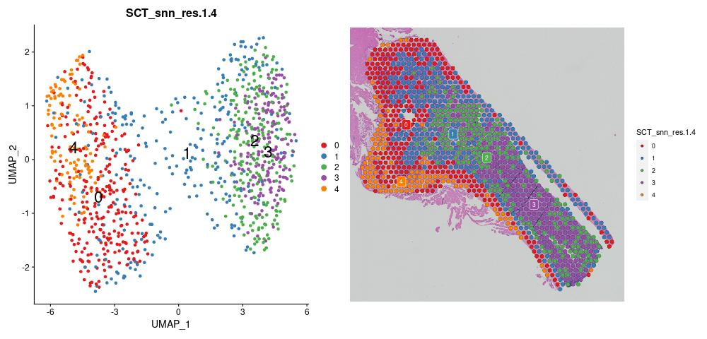
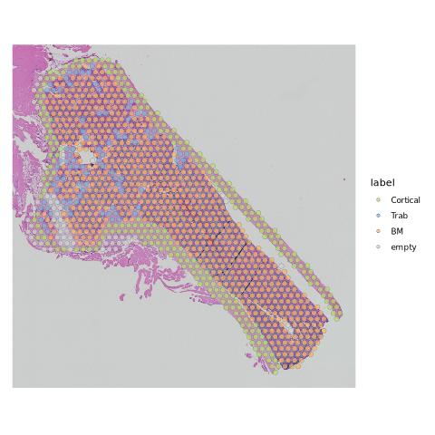
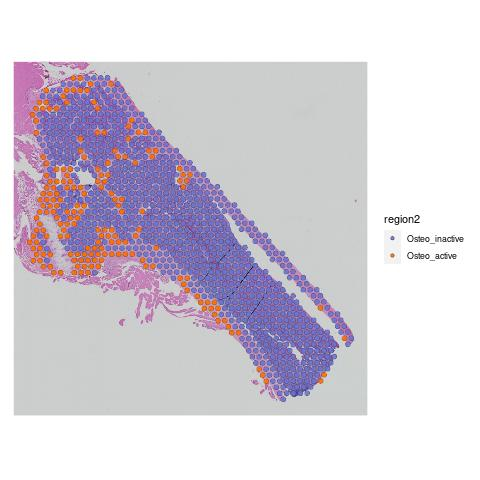
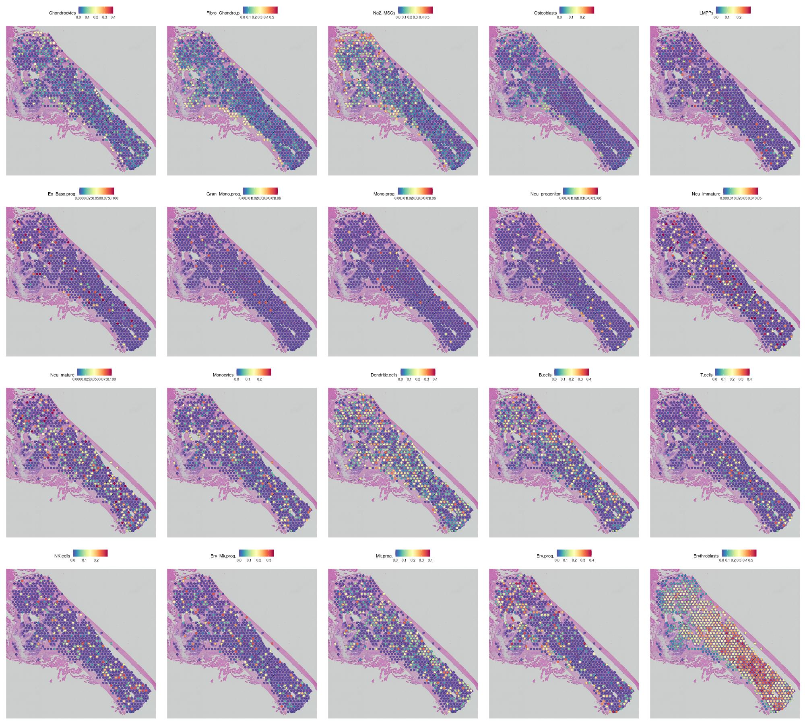
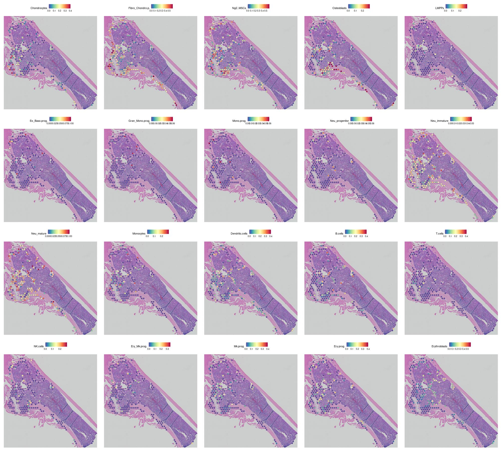
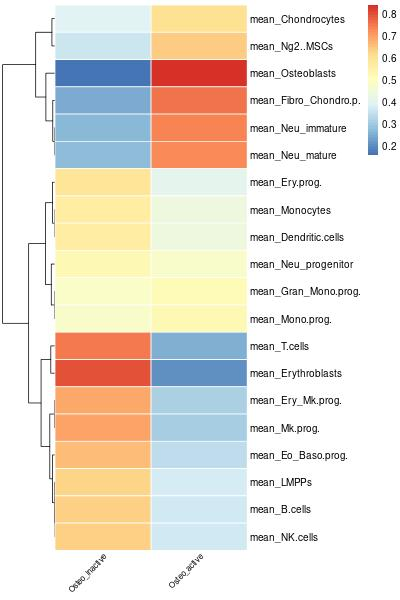
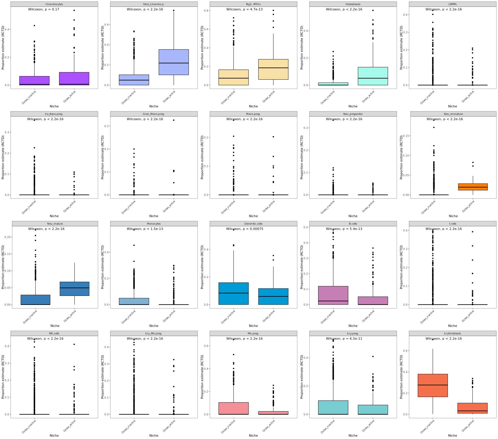
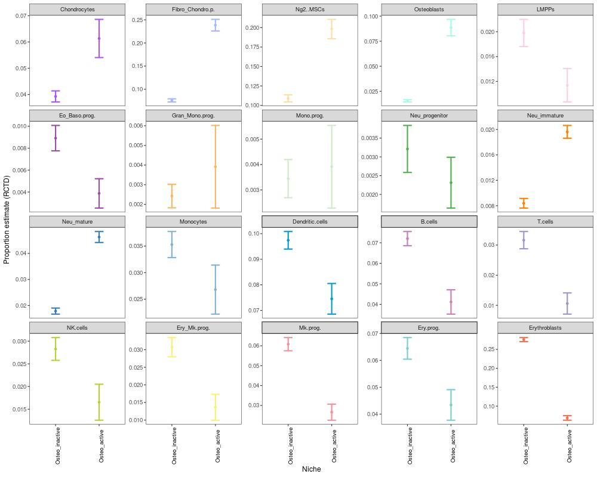

# 1. STUtility
## 1.1 数据导入
```r
library(STutility)
library(Seurat)
library(tidyverse)


rm(list=ls())
gc()

setwd('~/scRNA/Osteoblast_ST')


df <- data.frame(samples  =c("./GSE228534_RAW/GSM7123558_A1/GSM7123558_A1_filtered_feature_bc_matrix.h5"),
                   spotfiles = c("./GSE228534_RAW/GSM7123558_A1/spatial/tissue_positions_list.csv"),
                   imgs  = c("./GSE228534_RAW/GSM7123558_A1/spatial/tissue_hires_image.png"),
                   json = c("./GSE228534_RAW/GSM7123558_A1/spatial/scalefactors_json.json"))
df
```
## 1.2 交互式分析
```r
se <- InputFromTable(infotable = df, 
                     minUMICountsPerGene = 1, 
                     minSpotsPerGene = 1,
                     minUMICountsPerSpot = 0,
                     platform =  "Visium")

se <- LoadImages(se, time.resolve = FALSE, verbose = TRUE)

se <- ManualAnnotation(se)


saveRDS(se,"se.rds")
```

&nbsp;


# 2. Seurat分析
## 2.1 数据导入
```r
library(Seurat)
library(ggplot2)
library(patchwork)
library(dplyr)
#library(STutility)
library(RColorBrewer)


rm(list=ls())
gc()

setwd('~/scRNA/Osteoblast_ST')

color.vector <- c(brewer.pal(8, "Set1"), brewer.pal(12, "Set3"), brewer.pal(8, "Dark2"), brewer.pal(8, "Accent"))

# Keys： spatial analysis in Seurat
## load data
## data structure 
## new function: SpatialFeaturePlot， SpatialDimPlot, LinkedDimPlot
## subset datasets or images


## Load Your Own Dataset
Femur_1_1.img = Seurat::Read10X_Image('./GSE228534_RAW/GSM7123558_A1/spatial', image.name = 'tissue_lowres_image.png')
Femur_1_1 = Seurat::Load10X_Spatial(data.dir='./GSE228534_RAW/GSM7123558_A1',
                                filename = 'GSM7123558_A1_filtered_feature_bc_matrix.h5',
                                assay='Spatial',
                                slice='slice1',
                                image = Femur_1_1.img
)
Femur_1_1$orig.ident <- "Femur_1_1"
```


## 2.2 数据归一化
```r
plot1 <- VlnPlot(Femur_1_1, features = c("nCount_Spatial","nFeature_Spatial"), pt.size = 0.1, cols=color.vector)
plot2 <- SpatialFeaturePlot(Femur_1_1, features = c("nCount_Spatial","nFeature_Spatial"), slot='data') #+ theme(legend.position = "right")


jpeg("01-1_counts.jpg",width=1500)
wrap_plots(plot1, plot2)
dev.off()


Femur_1_1 <- SCTransform(Femur_1_1, assay = "Spatial", verbose = TRUE, min_cells=1)
DefaultAssay(Femur_1_1)
#[1] "SCT"

```

## 2.3 降维聚类
```r
Femur_1_1 <- RunPCA(Femur_1_1, assay = "SCT" ,verbose = TRUE)

Femur_1_1 <- FindNeighbors(Femur_1_1, reduction = "pca", dims = 1:30)

set.resolutions <- c(0.1,0.2,0.4,0.6,0.8,1,1.2,1.4)
library(clustree)

Femur_1_1 <- FindClusters(Femur_1_1, verbose = TRUE,resolution = set.resolutions)

jpeg("01-3_clustree.jpg",width=1000)
clustree(Femur_1_1@meta.data, prefix = "SCT_snn_res.")
dev.off()

res <- 'SCT_snn_res.1.4'


Femur_1_1 <- RunUMAP(Femur_1_1,reduction = "pca", dims = 1:30)

p1 <- DimPlot(Femur_1_1, reduction = "umap", label = TRUE,group.by=res,cols=color.vector,pt.size=1.5,label.size=8)
p2 <- SpatialDimPlot(Femur_1_1, label = TRUE, label.size = 3,group.by=res)+scale_fill_manual(values=color.vector)

jpeg("01-4_cluster.jpg",width=1000)
p1 + p2
dev.off()


jpeg("01-5_fp.jpg",width=2000,height=2000)
SpatialFeaturePlot(Femur_1_1, features = c("Elane", "Mpo","Prtn3","Ctsg","Ctsc","Ltf","Camp","Lcn2","Cyba","Cybb","Ncf1","B2m","Mmp9","Slpi","Hp","Ly6g",'S100a8',"S100a9","Tlr4","Ptpn11"),ncol=5, alpha = c(0.5, 1))
dev.off()
```


## 2.4 导入STUtility生成的位置信息
```r

se <- readRDS("se.rds")


table(se$labels)


se$labels[which(se$labels == "Default")] <-"BM"
table(se$labels)


rowname <- paste(rownames(Femur_1_1@meta.data),"1",sep="_")
label <- se$labels[match(rowname,rownames(se@meta.data))]

Femur_1_1$label <- label
Femur_1_1$label <- factor(Femur_1_1$label,levels=c("Cortical","Trab","BM","empty"))

table(Femur_1_1$label)
#      BM Cortical    empty     Trab
#    678      253       61       86


color <- c( "#B3DE69","#80B1D3","#FDB462","lightgrey")

jpeg("01-6_HE.jpg")
SpatialDimPlot(Femur_1_1, label = FALSE, group.by = "label",alpha=c(0.7,0.7))+scale_fill_manual(values=color)
dev.off()

pdf("01-6_HE.pdf")
SpatialDimPlot(Femur_1_1, label = FALSE, group.by = "label",alpha=c(0.5,0.5))+scale_fill_manual(values=color)
dev.off()
```


## 2.5 保存数据
```r
saveRDS(Femur_1_1,'rds/01_Femur_1_1.rds')

#Femur_1_1 <- readRDS('rds/01_Femur_1_1.rds')

```

# 3. 去除空Spot重新降维聚类
## 3.1 去除空Spot
```r
Femur_1_1 <- readRDS('rds/01_Femur_1_1.rds')

sce <- subset(Femur_1_1,subset=label %in% c("empty"),invert=TRUE)


color = c("#edd064","#fa6e01","#0eb0c8")

color = c("#E41A1C" ,"#377EB8", "#4DAF4A")
p2 <- SpatialDimPlot(sce, group.by="label",alpha = c(0.7, 0.7))+scale_fill_manual(values=color.vector)

jpeg("02-4_label.jpg")
p2
dev.off()

pdf("02-4_label.pdf")
p2
dev.off()
```

## 3.2 降维聚类
```r
sce <- SCTransform(sce, assay = "Spatial", verbose = TRUE,return.only.var.genes = TRUE,min_cells=1)
DefaultAssay(sce)
#[1] "SCT"

sce <- RunPCA(sce, assay = "SCT" ,verbose = TRUE)

sce <- FindNeighbors(sce, reduction = "pca", dims = 1:20)

set.resolutions <- c(0.1,0.2,0.4,0.6,0.8,1,1.2,1.4,1.6,1.8,2)
library(clustree)

sce <- FindClusters(sce, verbose = TRUE,resolution = set.resolutions)

jpeg("02-1_clustree.jpg",width=1000)
clustree(sce@meta.data, prefix = "SCT_snn_res.")
dev.off()

sce <- RunUMAP(sce,reduction = "pca", dims = 1:20)
sce <- RunTSNE(sce,reduction = "pca", dims = 1:20)

res <- 'SCT_snn_res.1.6'

color.vector <- c(brewer.pal(8, "Set1"), brewer.pal(12, "Set3"), brewer.pal(8, "Dark2"), brewer.pal(8, "Accent"), brewer.pal(8, "Set2"),  brewer.pal(9, "Pastel1"),  brewer.pal(8, "Pastel2"))

p1 <- DimPlot(sce, reduction = "umap", label = TRUE,group.by=res,pt.size=1.5,label.size=8,cols=color.vector,label.box = TRUE)
p2 <- SpatialDimPlot(sce, group.by=res)+scale_fill_manual(values=color.vector)

jpeg("02-2_cluster.jpg",width=1000)
p1 + p2
dev.off()
```

## 3.3 <mark>定义成骨活跃区</mark>
```r
genes_to_check <- c("Ptprc","Hba-a2","Mki67","Sparc","Postn","Col1a1","Bglap","Runx2","Sp7","Ctsk","Spp1","Elane", "Mpo","Prtn3","Ctsg","Ctsc","Ltf","Camp","Lcn2","Cyba","Cybb","Ncf1","B2m","Mmp9","Slpi","Hp","Ly6g","G0s2","S100a9")

dp <- DotPlot(sce, features = genes_to_check, assay = "SCT",cols=c("lightgrey","red"),dot.scale = 8, group.by = res) + 
	coord_flip() + 
	theme(axis.text.x = element_text(angle = 45, vjust = 0.5, hjust=0.5))


jpeg("02-3_dp.jpg")
dp
dev.off()


sce$region <- "Osteo_inactive"
index <- which(sce$SCT_snn_res.1.6 == 5)
sce$region[index] <- "Osteo_active"

sce$region <- factor(sce$region,levels=c("Osteo_inactive","Osteo_active"))


sce$region2 <- "Osteo_inactive"
index <- which(sce$SCT_snn_res.1.6 == 5)
sce$region2[index] <- "Osteo_active"

index <- which(sce$label == "Trab")
sce$region2[index] <- "Osteo_active"

sce$region2 <- factor(sce$region2,levels=c("Osteo_inactive","Osteo_active"))


sce$region3 <- "Osteo_inactive"

index <- which(sce$label == "Trab")
sce$region3[index] <- "Osteo_active"

sce$region3 <- factor(sce$region3,levels=c("Osteo_inactive","Osteo_active"))


color2 = c("#6a73cf","#fa6e01")

#p1 <- DimPlot(sce, reduction = "tsne", label = TRUE,group.by="region3",pt.size=1.5,label.size=8,cols=color2)
p2 <- SpatialDimPlot(sce, group.by="region2",alpha = c(0.9, 0.9))+scale_fill_manual(values=color2)

jpeg("02-4_region.jpg")
p2
dev.off()

pdf("02-4_region.pdf")
p2
dev.off()
```


## 3.4 保存数据
```r
saveRDS(sce,'rds/02_sce.rds')
```

## 3.5 成骨活跃区基因表达
```r
sce <- readRDS("rds/02_sce.rds")
DefaultAssay(sce) <- "Spatial"

sce <- NormalizeData(sce, normalization.method = "LogNormalize", scale.factor = 1e4)
sce <- FindVariableFeatures(sce, selection.method = "vst", nfeatures = 3000)


all.genes <- rownames(sce)
sce <- ScaleData(sce, features = all.genes)


DefaultAssay(sce) <- "SCT"


Osteoblasts <- c("Slpi","Col1a1","Bglap","Bglap2","Sp7","Spp1","Runx2") 
Neu_prog <- c("Elane", "Mpo","Prtn3",'Hexa','Prss57','Ctsg','Ctsc')
Neu_immature <- c("Ltf","Camp","Ngp","Lcn2",'Cyba','Cybb','Ncf1','Ncf4','B2m','Lyz2')
Neu_mature <- c('Ceacam1',"Mmp8","Mmp9",'Itgam','Slc11a1','Hp','Slpi') 

genes <- unique(c(Osteoblasts,Neu_prog,Neu_immature,Neu_mature,"S100a8","S100a9"))


jpeg("02-5_vln.jpg",height=1300,width=2000)
VlnPlot(sce,features=genes,fill="ident",cols=color2,pt.size=0,group.by="region2",ncol=8)
dev.off()


pdf("02-5_vln.pdf",height=18.96,width=29.17)
VlnPlot(sce,features=genes,fill="ident",cols=color2,pt.size=0,group.by="region2",ncol=8)
dev.off()


jpeg("02-6_fp.jpg",height=1300,width=2000)
SpatialFeaturePlot(sce, features = genes,ncol=8, alpha = c(0.5, 1))
dev.off()


pdf("02-6_fp.pdf",width=29.17,height=18.96)
SpatialFeaturePlot(sce, features = genes,ncol=8, alpha = c(0.5, 1))
dev.off()


Osteoblasts <- c("Slpi","Col1a1","Bglap","Sp7","Spp1","Runx2") 
Neu_prog <- c("Elane", "Mpo","Prtn3",'Hexa','Ctsg','Ctsc')
Neu_immature <- c("Ltf","Camp","Ngp","Lcn2",'Cyba','Cybb','Ncf1','Ncf4','B2m','Lyz2')
Neu_mature <- c('Ceacam1',"Mmp8","Mmp9",'Slc11a1','Hp','Slpi') 

genes <- unique(c(Osteoblasts,Neu_prog,Neu_immature,Neu_mature,"S100a8","S100a9"))

dp <- DotPlot(sce, features = genes, assay = "SCT",cols=c("lightgrey","red"),dot.scale = 8,scale.min = 5,group.by = "region2",) + 
	coord_flip() + 
	RotatedAxis()


jpeg("02-6_dp.jpg")
dp
dev.off()
```
- 热图
```r
av <- AverageExpression(sce,
                       group.by = "label",
                       assays = "SCT",
					   slot="data")
av=av[[1]]
head(av)
dim(av)


genes_to_check <- c("Ptprc","Hba-a2","Mki67","Sparc","Postn","Col1a1","Bglap","Runx2","Sp7","Ctsk","Elane", "Mpo","Prtn3","Ctsg","Ctsc","Ltf","Camp","Lcn2","Cyba","Cybb","Ncf1","Mmp9","Slpi","Hp","Ly6g",'S100a8',"S100a9","Tlr4","Ptpn11")
genes_to_check <- c("Ptprc","Hba-a2","Mki67","Sparc","Postn","Col1a1","Bglap","Runx2","Sp7","Ctsk","Spp1")
genes_to_check %in% rownames(av)

dat <- av[genes_to_check,]
min(dat)
max(dat)

bk <- c(seq(-2,-0.1,by=0.01),seq(0,2,by=0.01))


library(pheatmap)

# 做热图：
jpeg('02-6_htmp.jpg',height=500,width=300)
pheatmap(dat,
         scale = "row",
		 cluster_rows = F,
		 cluster_cols= F,
		 #gaps_row=c(3,10,15,21),
		 #gaps_row=c(3),
		 color = c(colorRampPalette(colors = c("#0F86A9" ,"#5FAEC5","#AFD6E2","#FFFFFF"))(length(bk)/2),colorRampPalette(colors = c("#FFFFFF","#F9D8AF","#F3B15F","#ED8B10"))(length(bk)/2)),
         #color = c(colorRampPalette(colors = c("#476FA9","#5D85B5","#8DBED6","#F9F9F9"))(length(bk)/2),colorRampPalette(colors = c("#F9F9F9","#D1425A","#C3262A"))(length(bk)/2)),
         breaks=bk,
		 angle_col=45,
		 #cellwidth = 45, 
		 #cellheight = 30,
		 border_color= "white")
dev.off()	


pdf('02-6_htmp.pdf',height=7.3,width=4.375)
pheatmap(dat,
         scale = "row",
		 cluster_rows = F,
		 cluster_cols= F,
		 #gaps_row=c(3,10,15,21),
		 #gaps_row=c(3),
		 color = c(colorRampPalette(colors = c("#0F86A9" ,"#5FAEC5","#AFD6E2","#FFFFFF"))(length(bk)/2),colorRampPalette(colors = c("#FFFFFF","#F9D8AF","#F3B15F","#ED8B10"))(length(bk)/2)),
         #color = c(colorRampPalette(colors = c("#476FA9","#5D85B5","#8DBED6","#F9F9F9"))(length(bk)/2),colorRampPalette(colors = c("#F9F9F9","#D1425A","#C3262A"))(length(bk)/2)),
         breaks=bk,
		 angle_col=45,
		 #cellwidth = 45, 
		 #cellheight = 30,
		 border_color= "white")
dev.off()

```
## 3.6 区域差异表达分析
```r
DefaultAssay(sce) <- "Spatial"

library(EnsDb.Mmusculus.v79)
edb <- EnsDb.Mmusculus.v79
keys <- keys(edb, keytype="GENEID")
## Get the data
gene2sym <- select(edb, keys=keys, 
  columns=c("SYMBOL","ENTREZID","GENEBIOTYPE",'GENENAME'),
  keytype="GENEID")
table(gene2sym$GENEBIOTYPE)

ncRNA = gene2sym$SYMBOL[which(gene2sym$GENEBIOTYPE %in% c('lincRNA','miRNA','snRNA','snoRNA','piRNA','siRNA'))]
nofilter = sort(setdiff(rownames(sce),as.character(unique(c(rownames(sce)[grep('^mt-|^Rp|^Atp|^Hb[^(p)]',rownames(sce))],ncRNA)))))

length(nofilter)
#[1] 19528

sce2 <- subset(sce,features=nofilter)

Idents(sce2) <- "region2"
levels(sce2)

marker <- FindAllMarkers(
		sce2, logfc.threshold = 0, min.pct = 0.1, #test.use = "roc"
		test.use = "wilcox"
	)
	
write.csv(marker,"Deg.csv",row.names=T)
```

&nbsp;
# 4. RCTD进行scRNA-seq数据联合分析
> RCTD

## 4.1 数据整理
```r
#devtools::install_github("dmcable/spacexr", build_vignettes = FALSE) #安装RCTD
library(spacexr)

rm(list=ls())
gc()
# set up reference
ref <- readRDS("~/scRNA/Osteoblast_ST/GSE122464/rds/02_NicheData10x.rds")
#ref <- UpdateSeuratObject(ref)

table(ref$celltype4)

ref$celltype4 <- as.vector(ref$celltype4)
table(ref$celltype4)

index <- which(ref$celltype4 == "Fibro/Chondro p.")
ref$celltype4[index] <- "Fibro_Chondro p."

index <- which(ref$celltype4 == "Eo/Baso prog.")
ref$celltype4[index] <- "Eo_Baso prog."

index <- which(ref$celltype4 == "Gran/Mono prog.")
ref$celltype4[index] <- "Gran_Mono prog."

index <- which(ref$celltype4 == "Ery/Mk prog.")
ref$celltype4[index] <- "Ery_Mk prog."


ref$celltype4 <- factor(ref$celltype4,levels=c('Chondrocytes','Fibro_Chondro p.','Ng2+ MSCs',"Osteoblasts",'LMPPs','Eo_Baso prog.','Gran_Mono prog.','Mono prog.' ,'Neu_progenitor','Neu_immature','Neu_mature','Monocytes','Dendritic cells',"B cells",'T cells','NK cells','Ery_Mk prog.','Mk prog.','Ery prog.','Erythroblasts'))

table(ref$celltype4)

Idents(ref) <- "celltype4"
```

## 4.2 提取信息传递给RCTD参考函数
```r
counts <- ref@assays$RNA@counts
cluster <- as.factor(ref$celltype4)
names(cluster) <- colnames(ref)
nUMI <- ref$nCount_RNA
names(nUMI) <- colnames(ref)
reference <- Reference(counts, cluster, nUMI) 
#构建用于参考的单细胞数据，这里其实重点就是counts单细胞表达矩阵，cluster是我们的celltype4的注释，nUMI可以为空

```

## 4.3 利用RCTD函数SpatialRNA建立查询
```r
st_data <- readRDS("rds/02_sce.rds") #载入我们的空间转录组数据，如果是标准的space ranger数据可以使用Load10X_Spatial载入


counts <- st_data[["Spatial"]]@counts
coords <- GetTissueCoordinates(st_data)
colnames(coords) <- c("x", "y")
coords[is.na(colnames(coords))] <- NULL
query <- SpatialRNA(coords, counts, colSums(counts))

```
## 4.4 运行RCTD开始反卷积
```r
RCTD <- create.RCTD(query, reference,CELL_MIN_INSTANCE = 20, max_cores = 8)
RCTD <- run.RCTD(RCTD, doublet_mode = "full") 
# 我们使用10X Visium的数据，由于spot的特性，使用full，如果是高分辨率的平台可以使用doublet或singlet
decon_mtrx <- as.matrix(RCTD@results$weights)
dim(decon_mtrx)
#[1] 915  33
```

## 4.5 保存数据
```r
write.csv(decon_mtrx,"decon_mtrx.csv",quote=FALSE)
#decon_mtrx <- read.csv("decon_mtrx.csv",header=TRUE,row.names=1)
```

## 4.6 可视化
### 4.6.1 FeaturePlot可视化
```r
library(Seurat)
library(ggplot2)
library(patchwork)
library(dplyr)
#library(STutility)
library(RColorBrewer)


rm(list=ls())
gc()

setwd('~/scRNA/Osteoblast_ST')

color.vector <- c(brewer.pal(8, "Set1"), brewer.pal(12, "Set3"), brewer.pal(8, "Dark2"), brewer.pal(8, "Accent"))
```

```r
st_data <- readRDS("rds/02_sce.rds") 

decon_mtrx <- read.csv("decon_mtrx.csv",header=TRUE,row.names=1)

#计算每一个spot中各个细胞类型的占比
dat <- data.frame(t(apply(decon_mtrx, 1, function(x) x/sum(x))))

st_data$cell <- names(st_data$orig.ident)
st_data2 <- subset(st_data, cell %in% rownames(dat))


dat2 <- dat[match(rownames(st_data2@meta.data),rownames(dat)),]

st_data2 <- AddMetaData(object = st_data2,metadata =data.frame(dat2))

		
jpeg("06-1_proportion.jpg",width=2000,height=1800)
SpatialFeaturePlot(st_data2, features =c('Chondrocytes','Fibro_Chondro.p.','Ng2..MSCs',"Osteoblasts",'LMPPs','Eo_Baso.prog.','Gran_Mono.prog.','Mono.prog.' ,'Neu_progenitor','Neu_immature','Neu_mature','Monocytes','Dendritic.cells',"B.cells",'T.cells','NK.cells','Ery_Mk.prog.','Mk.prog.','Ery.prog.','Erythroblasts'),,ncol=5, alpha = c(0.5, 1))
dev.off()

pdf("06-1_proportion.pdf",width=29.17,height=26.25)
SpatialFeaturePlot(st_data2, features =c('Chondrocytes','Fibro_Chondro.p.','Ng2..MSCs',"Osteoblasts",'LMPPs','Eo_Baso.prog.','Gran_Mono.prog.','Mono.prog.' ,'Neu_progenitor','Neu_immature','Neu_mature','Monocytes','Dendritic.cells',"B.cells",'T.cells','NK.cells','Ery_Mk.prog.','Mk.prog.','Ery.prog.','Erythroblasts'),max.cutoff = 'q98',ncol=5, alpha = c(0.5, 1))
dev.off()

```
- 分区展示
```r
dat3 <- dat2

for(i in 1:length(cells)){
	print(max(dat3[,cells[i]]))
	max_prop <- max(dat3[,cells[i]])
	dat3[,cells[i]][dat3[,cells[i]] > thre[i]] <- thre[i]
}


st_data2 <- AddMetaData(object = st_data2,metadata =data.frame(dat3))

sce <- subset(st_data2,subset=region2 =="Osteo_active")
sce2 <- subset(st_data2,subset=region2 =="Osteo_inactive")


cells <- c('Chondrocytes','Fibro_Chondro.p.','Ng2..MSCs',"Osteoblasts",'LMPPs','Eo_Baso.prog.','Gran_Mono.prog.','Mono.prog.' ,'Neu_progenitor','Neu_immature','Neu_mature','Monocytes','Dendritic.cells',"B.cells",'T.cells','NK.cells','Ery_Mk.prog.','Mk.prog.','Ery.prog.','Erythroblasts')
thre <- c(0.4,0.6,0.6,0.3,0.3,
0.1,0.06,0.06,0.06,0.05,
0.1,0.3,0.4,0.4,0.4,
0.3,0.35,0.4,0.4,0.6)


SpatialColors <- colorRampPalette(colors = rev(x = brewer.pal(n = 11, name = "Spectral")))


p_list <- list()
p_list2 <- list()


for(i in 1:length(cells)){
	p1 <- SpatialFeaturePlot(sce2, features =cells[i],alpha = c(1, 1),max.cutoff = "q98") & scale_fill_gradientn(limits=c(0, thre[i]), colours=SpatialColors(n=100))

	p2 <- SpatialFeaturePlot(sce, features =cells[i],alpha = c(1, 1),max.cutoff = "q98") & scale_fill_gradientn(limits=c(0, thre[i]), colours=SpatialColors(n=100))

	#j <- 2*i
	#k <- j-1

	p_list[[i]] <- p1
	p_list2[[i]] <- p2

}


library(cowplot)
jpeg("06-2_prop_inactive.jpg",width=2000,height=1800)
plot_grid(plotlist=p_list,ncol=5)
dev.off()

jpeg("06-3_prop_active.jpg",width=2000,height=1800)
plot_grid(plotlist=p_list2,ncol=5)
dev.off()


pdf("06-2_prop_inactive.pdf",width=29.17,height=26.25)
plot_grid(plotlist=p_list,ncol=5)
dev.off()

pdf("06-3_prop_active.pdf",width=29.17,height=26.25)
plot_grid(plotlist=p_list2,ncol=5)
dev.off()

```

<table>
    <tr>
        <td ><center></center></td>
        <td ><center></center></td>
    </tr>
</table>


### 4.6.2 热图
```r

meta <- c("region2",'Chondrocytes','Fibro_Chondro.p.','Ng2..MSCs',"Osteoblasts",'LMPPs','Eo_Baso.prog.','Gran_Mono.prog.','Mono.prog.' ,'Neu_progenitor','Neu_immature','Neu_mature','Monocytes','Dendritic.cells',"B.cells",'T.cells','NK.cells','Ery_Mk.prog.','Mk.prog.','Ery.prog.','Erythroblasts')
cells <- c('Chondrocytes','Fibro_Chondro.p.','Ng2..MSCs',"Osteoblasts",'LMPPs','Eo_Baso.prog.','Gran_Mono.prog.','Mono.prog.' ,'Neu_progenitor','Neu_immature','Neu_mature','Monocytes','Dendritic.cells',"B.cells",'T.cells','NK.cells','Ery_Mk.prog.','Mk.prog.','Ery.prog.','Erythroblasts')

dat <- st_data2@meta.data[,meta]


# 使用dplyr进行分组求均值
grouped_data <- dat %>%
  group_by(region2) %>%
  summarise(across(cells, mean, .names = "mean_{col}"))
 
print(grouped_data)

dat2 <- data.frame(grouped_data)

dat3 <- dat2[,2:ncol(dat2)]
rownames(dat3) <- dat2$region2


df_new <- apply(dat3, 2, function(x) x/sum(x))


library(pheatmap)
library(viridis)

bk <- seq(0,1,by=0.01)


jpeg('07-1_htmp.jpg',width=400,height=600)
pheatmap(t(df_new),
                    show_colnames = TRUE,
                    cluster_rows =TRUE,cluster_cols = FALSE ,
					 fontsize_col = 8,
		 angle_col=45,
		 border_color = "white")
dev.off()


pdf('07-1_htmp.pdf',width=5.83,height=8.75)
pheatmap(t(df_new),
                    show_colnames = TRUE,
                    cluster_rows =TRUE,cluster_cols = FALSE ,
					 fontsize_col = 8,
		 angle_col=45,
		 border_color = "white")
dev.off()

```


### 4.6.3 占比箱线图
```r

library(tidyr)
library(ggpubr)

rm(list=ls())
gc()

setwd('~/scRNA/Osteoblast_ST')

decon_mtrx <- read.csv("decon_mtrx.csv",header=TRUE,row.names=1)
st_data <- readRDS("rds/02_sce.rds") 

dat <- data.frame(t(apply(decon_mtrx, 1, function(x) x/sum(x))))

st_data$cell <- names(st_data$orig.ident)
st_data2 <- subset(st_data, cell %in% rownames(dat))

dat$region <- st_data2$region2[match(rownames(dat),rownames(st_data2@meta.data))]  #第5簇+松质骨

write.csv(dat,"RCTD_matrix_5_trab.csv",quote=FALSE)
#dat <- read.csv("RCTD_matrix_5_trab.csv",header=TRUE,row.names=1)
```

```r

dat2 <- gather(dat, celltype4, proportion,-region)

dat2$celltype4 <- factor(dat2$celltype4,levels=c('Chondrocytes','Fibro_Chondro.p.','Ng2..MSCs',"Osteoblasts",'LMPPs','Eo_Baso.prog.','Gran_Mono.prog.','Mono.prog.' ,'Neu_progenitor','Neu_immature','Neu_mature','Monocytes','Dendritic.cells',"B.cells",'T.cells','NK.cells','Ery_Mk.prog.','Mk.prog.','Ery.prog.','Erythroblasts'))
dat2$region <- factor(dat2$region,levels=c("Osteo_inactive","Osteo_active"))


pal <- c(Chondrocytes="#ab51ff",`Fibro_Chondro.p.`="#a7b7f9",`Ng2..MSCs`="#f9e0a7", Osteoblasts="#a7f9e9",LMPPs="#FCCDE5", `Eo_Baso.prog.`="#984EA3",`Gran_Mono.prog.`="#FDB462", `Mono.prog.`="#CCEBC5", Neu_progenitor="#4DAF4A" ,Neu_immature="#FF7F00", Neu_mature="#377EB8",Monocytes="#80B1D3", `Dendritic.cells`="#009ad6", `B.cells`="#c77eb5",`T.cells`= "#9b95c9",`NK.cells`="#b2d235",`Ery_Mk.prog.`= "#fcf16e", `Mk.prog.`="#f58f98", `Ery.prog.`="#78cdd1", Erythroblasts="#f3704b")


plot_list <- list()

for (i in levels(dat2$celltype4)) {
	p <- ggplot(aes(x = region, y= proportion,color = "black",fill=celltype4),data=dat2[dat2$celltype4==i,]) + 
	geom_boxplot() +  
	facet_wrap(~ celltype4, scales="free_y") + 
	theme_bw()+
    theme(panel.grid=element_blank())+
	ylab("Proportion estimate (RCTD)") + 
	scale_color_manual(values = "black", guide=F) + 
	scale_fill_manual(values = pal, guide=F) + 
	xlab("Niche") + 
	#scale_x_discrete(labels = labeler)+
	RotatedAxis()
	
	plot_list[[i]] <- p

} 
#install.packages("ggpval")
library(ggpval)

plot_list2 <- list()

for(i in levels(dat2$celltype4)){
	p <- plot_list[[i]]+stat_compare_means(method = "wilcox.test")
	plot_list2[[i]] <- p
}


library(cowplot)
jpeg("04-4_proportion_5_trab.jpg",width=1700,height=1500)
plot_grid(plotlist=plot_list2,ncol=5)
dev.off()

pdf("04-4_proportion_5_trab.pdf",width=24.8,height=21.875)
plot_grid(plotlist=plot_list2,ncol=5)
dev.off()


jpeg("04-5_proportion_5_trab.jpg",width=1000,height=800)
ggplot(aes(x = region, y= proportion ,color = celltype4),data=dat2) + geom_point(stat="summary", fun.y=mean) + 
  #stat_compare_means(method = "anova")+
  facet_wrap(~ celltype4, scales="free_y") + 
  theme_bw(base_size=12) + 
  theme(axis.text.x = element_text(angle=90, color="black"), panel.grid = element_blank()) + 
  geom_errorbar(stat="summary", fun.ymin=function(x) mean(x)+sd(x)/sqrt(length(x)),fun.ymax=function(x) mean(x)-sd(x)/sqrt(length(x)), width=0.2,size=1) + 
  ylab("Proportion estimate (RCTD)") + 
  scale_color_manual(values = pal, guide=F) + 
  xlab("Niche") 
 #scale_x_discrete(labels = labeler)
dev.off()


pdf("04-5_proportion_5_trab.pdf",width=14.6,height=11.7)
ggplot(aes(x = region, y= proportion ,color = celltype4),data=dat2) + geom_point(stat="summary", fun.y=mean) + 
  #stat_compare_means(method = "anova")+
  facet_wrap(~ celltype4, scales="free_y") + 
  theme_bw(base_size=12) + 
  theme(axis.text.x = element_text(angle=90, color="black"), panel.grid = element_blank()) + 
  geom_errorbar(stat="summary", fun.ymin=function(x) mean(x)+sd(x)/sqrt(length(x)),fun.ymax=function(x) mean(x)-sd(x)/sqrt(length(x)), width=0.2,size=1) + 
  ylab("Proportion estimate (RCTD)") + 
  scale_color_manual(values = pal, guide=F) + 
  xlab("Niche") 
 #scale_x_discrete(labels = labeler)
dev.off()

```
<table>
    <tr>
        <td ><center></center></td>
        <td ><center></center></td>
    </tr>
</table>

### 4.6.4 相关性拟合曲线
```r

library(ggplot2)
library(ggpubr)

dat <- read.csv("RCTD_matrix_5_trab.csv",header=TRUE,row.names=1)

y <- dat$Osteoblasts
outTab=data.frame()
plot_list = list()

for(j in colnames(dat)[-c(4,21)]){
	x <- dat[,j]
	df1=as.data.frame(cbind(x,y))
	corT=cor.test(x,y,method="pearson")
	
	cor=corT$estimate
	pValue=corT$p.value

	plot_list[[j]] <- ggplot(df1, aes(x, y)) + 
		ylab("Osteoblasts")+xlab(j)+
		geom_point(size=5,shape=21,fill="black",colour="black",alpha = 0.5)+ geom_smooth(method="lm",formula=y~x,colour = "black",size = 3) + 
		theme_bw()+
        theme(panel.grid=element_blank())+
		stat_cor(method = 'pearson', aes(x =x, y =y))+
		# 调整横坐标刻度字体大小
  theme(axis.text.x = element_text(size = 13)) +
  # 调整横坐标轴标题字体大小
  theme(axis.title.x = element_text(size = 15)) +
  # 调整纵坐标刻度字体大小
  theme(axis.text.y = element_text(size = 13)) +
  # 调整纵坐标轴标题字体大小
  theme(axis.title.y = element_text(size = 15))
  
	outTab=rbind(outTab,cbind(Cell=j,pValue,cor))		
}
outTab

write.csv(outTab,file="Cor.result.csv",row.names=F,quote=F)


jpeg("04-6_corPlot.jpg",width=1500,height=1200)
plot_grid(plotlist=plot_list,ncol=5)
dev.off()

pdf("04-6_corPlot.pdf",width=21.875,height=17.5)
plot_grid(plotlist=plot_list,ncol=5)
dev.off()
```

### 4.6.5 相关性热图
```r
library(psych)


dat <- read.csv("RCTD_matrix_5_trab.csv",header=TRUE,row.names=1)
dat2 <- dat[,-ncol(dat)]


#自定义颜色；

mycol <-colorRampPalette(c( "#0f86a9", "white", "#ed8b10"))(200)


library(corrplot)

tdc <- cor(dat2, method="pearson")

#显著性计算：
testRes = cor.mtest(dat2, method="pearson",conf.level = 0.95)

#绘制上三角热图；
jpeg("04-7_cor_htmp.jpg")
corrplot(tdc, method = "color", 
			col = mycol, 
			tl.col = "black", 
			tl.cex = 0.8, 
			tl.srt = 45,
			#tl.pos = "lt",
            p.mat = testRes$p, 
			diag = F, 
			type = 'upper',
            sig.level = c(0.001, 0.01, 0.05), 
			pch.cex = 0.8,
            insig = 'label_sig', 
			pch.col = 'grey20', 
			order = 'original')
dev.off()


pdf("04-7_cor_htmp.pdf")
corrplot(tdc, method = "color", 
			col = mycol, 
			tl.col = "black", 
			tl.cex = 0.8, 
			tl.srt = 45,
			#tl.pos = "lt",
            p.mat = testRes$p, 
			diag = F, 
			type = 'upper',
            sig.level = c(0.001, 0.01, 0.05), 
			pch.cex = 0.8,
            insig = 'label_sig', 
			pch.col = 'grey20', 
			order = 'original')
dev.off()
```


&nbsp;
# 5. RCTD进行scRNA-seq数据联合分析
> RCTD

## 5.1 数据整理
```r
#devtools::install_github("dmcable/spacexr", build_vignettes = FALSE) #安装RCTD
library(spacexr)
library(Seurat)

rm(list=ls())
gc()

setwd('~/scRNA/Osteoblast_ST')

# set up reference
ref <- dior::read_h5("/home/luchun/scRNA/Bone_neu/01_age/05_neu_anno.h5")


Idents(ref) <- "preAnno"
levels(ref)

```

## 5.2 提取信息传递给RCTD参考函数
```r
counts <- ref@assays$RNA@counts
cluster <- as.factor(ref$preAnno)

names(cluster) <- colnames(ref)
nUMI <- ref$total_counts
names(nUMI) <- colnames(ref)
reference <- Reference(counts, cluster, nUMI) 
#构建用于参考的单细胞数据，这里其实重点就是counts单细胞表达矩阵，cluster是我们的celltype4的注释，nUMI可以为空

```

## 5.3 利用RCTD函数SpatialRNA建立查询
```r
st_data <- readRDS("rds/02_sce.rds") #载入我们的空间转录组数据，如果是标准的space ranger数据可以使用Load10X_Spatial载入


counts <- st_data[["Spatial"]]@counts
coords <- GetTissueCoordinates(st_data)
colnames(coords) <- c("x", "y")
coords[is.na(colnames(coords))] <- NULL
query <- SpatialRNA(coords, counts, colSums(counts))

```
## 5.4 运行RCTD开始反卷积
```r
RCTD <- create.RCTD(query, reference,CELL_MIN_INSTANCE = 20, max_cores = 8)
RCTD <- run.RCTD(RCTD, doublet_mode = "full") 
# 我们使用10X Visium的数据，由于spot的特性，使用full，如果是高分辨率的平台可以使用doublet或singlet

decon_mtrx <- as.matrix(RCTD@results$weights)
dim(decon_mtrx)
#[1] 915  7
```

## 5.5 保存数据
```r
write.csv(decon_mtrx,"decon_mtrx_Neu.csv",quote=FALSE)
#decon_mtrx <- read.csv("decon_mtrx_Neu.csv",header=TRUE,row.names=1)
```


## 5.6 可视化
### 5.6.1 FeaturePlot可视化
```r
library(Seurat)
library(ggplot2)
library(patchwork)
library(dplyr)
#library(STutility)
library(RColorBrewer)


rm(list=ls())
gc()

setwd('~/scRNA/Osteoblast_ST')

color.vector <- c(brewer.pal(8, "Set1"), brewer.pal(12, "Set3"), brewer.pal(8, "Dark2"), brewer.pal(8, "Accent"))
```


```r
st_data <- readRDS("~/scRNA/Osteoblast_ST/rds/02_sce.rds") 

decon_mtrx <- read.csv("decon_mtrx_Neu.csv",header=TRUE,row.names=1)

st_data$cell <- names(st_data$orig.ident)
st_data2 <- subset(st_data, cell %in% rownames(decon_mtrx))


st_data2 <- AddMetaData(object = st_data2,metadata =decon_mtrx)

write.csv(st_data2@meta.data,'meta.data.csv',quote=FALSE)

```

```r
decon_mtrx <- read.csv('meta.csv',header=TRUE,row.names=1)
head(decon_mtrx)

#计算每一个spot中各个细胞类型的占比
dat <- data.frame(t(apply(decon_mtrx, 1, function(x) x/sum(x))))


dat2 <- dat[match(rownames(st_data2@meta.data),rownames(dat)),]

st_data2 <- AddMetaData(object = st_data2,metadata =data.frame(dat2))

head(st_data2@meta.data)

		
jpeg("06-1_neu_proportion.jpg",width=1600,height=800)
SpatialFeaturePlot(st_data2, features =c("Elane.Prtn3..progenitor","H2afz.Hmgb2..proliferating","Ngp.Lcn2..immature","Ifitm6.Ltf..immature","Retnlg.Mmp8..mature","Ccl6.Sell..mature","Il1b.Srgn..mature"),ncol=4, alpha = c(0.5, 1))
dev.off()
max.cutoff = 'q99',


pdf("06-1_neu_proportion.pdf",width=23.33,height=11.67)
SpatialFeaturePlot(st_data2, features =c("Elane.Prtn3..progenitor","H2afz.Hmgb2..proliferating","Ngp.Lcn2..immature","Ifitm6.Ltf..immature","Retnlg.Mmp8..mature","Ccl6.Sell..mature","Il1b.Srgn..mature"),ncol=4, alpha = c(0.5, 1))
dev.off()
max.cutoff = 'q99',


```
- 分区展示
```r

sce <- subset(st_data2,subset=region2 =="Osteo_active")
sce2 <- subset(st_data2,subset=region2 =="Osteo_inactive")


cells <- c("Elane.Prtn3..progenitor","H2afz.Hmgb2..proliferating","Ngp.Lcn2..immature","Ifitm6.Ltf..immature","Retnlg.Mmp8..mature","Ccl6.Sell..mature","Il1b.Srgn..mature")
thre <- c(0.55,0.5,0.8,0.6,0.5,0.6,0.5)


SpatialColors <- colorRampPalette(colors = rev(x = brewer.pal(n = 11, name = "Spectral")))


p_list <- list()
p_list2 <- list()


for(i in 1:length(cells)){
	p1 <- SpatialFeaturePlot(sce2, features =cells[i],alpha = c(0.5, 1)) & scale_fill_gradientn(limits=c(0, thre[i]), colours=SpatialColors(n=100))

	p2 <- SpatialFeaturePlot(sce, features =cells[i],alpha = c(0.5, 1)) & scale_fill_gradientn(limits=c(0, thre[i]), colours=SpatialColors(n=100))

	#j <- 2*i
	#k <- j-1

	p_list[[i]] <- p1
	p_list2[[i]] <- p2

}


library(cowplot)
jpeg("06-2_neu_prop_inactive.jpg",width=1600,height=800)
plot_grid(plotlist=p_list,ncol=4)
dev.off()

jpeg("06-3_neu_prop_active.jpg",width=1600,height=800)
plot_grid(plotlist=p_list2,ncol=4)
dev.off()


pdf("06-2_neu_prop_inactive.pdf",width=23.33,height=11.67)
plot_grid(plotlist=p_list,ncol=4)
dev.off()

pdf("06-3_neu_prop_active.pdf",width=23.33,height=11.67)
plot_grid(plotlist=p_list2,ncol=4)
dev.off()

```

<table>
    <tr>
        <td ><center></center></td>
        <td ><center></center></td>
    </tr>
</table>


### 4.6.2 热图
```r

meta <- c("region2","Elane.Prtn3..progenitor","H2afz.Hmgb2..proliferating","Ngp.Lcn2..immature","Ifitm6.Ltf..immature","Retnlg.Mmp8..mature","Ccl6.Sell..mature","Il1b.Srgn..mature")
cells <- c("Elane.Prtn3..progenitor","H2afz.Hmgb2..proliferating","Ngp.Lcn2..immature","Ifitm6.Ltf..immature","Retnlg.Mmp8..mature","Ccl6.Sell..mature","Il1b.Srgn..mature")

dat <- st_data2@meta.data[,meta]


# 使用dplyr进行分组求均值
grouped_data <- dat %>%
  group_by(region2) %>%
  summarise(across(cells, mean, .names = "mean_{col}"))
 
print(grouped_data)

dat2 <- data.frame(grouped_data)

dat3 <- dat2[,2:ncol(dat2)]
rownames(dat3) <- dat2$region2


df_new <- apply(dat3, 2, function(x) x/sum(x))


library(pheatmap)
library(viridis)

bk <- seq(0,1,by=0.01)


jpeg('07-1_neu_htmp.jpg',width=400,height=600)
pheatmap(t(df_new),
                    show_colnames = TRUE,
                    cluster_rows =TRUE,cluster_cols = FALSE ,
					 fontsize_col = 8,
		 angle_col=45,
		 border_color = "white")
dev.off()


pdf('07-1_htmp.pdf',width=5.83,height=8.75)
pheatmap(t(df_new),
                    show_colnames = TRUE,
                    cluster_rows =TRUE,cluster_cols = FALSE ,
					 fontsize_col = 8,
		 angle_col=45,
		 border_color = "white")
dev.off()

```


### 4.6.3 占比箱线图
```r

library(tidyr)
library(ggpubr)

rm(list=ls())
gc()

setwd('~/scRNA/Osteoblast_ST')

meta <- read.csv("meta.csv",header=TRUE,row.names=1)
colnames(meta)

dat <- data.frame(t(apply(meta, 1, function(x) x/sum(x))))

dat$region <- c(rep('Osteo_active',178),rep('Osteo_inactive',737))
```

```r

dat2 <- gather(dat, celltype, proportion,-region)

dat2$celltype <- factor(dat2$celltype,levels=c("Elane.Prtn3..progenitor","H2afz.Hmgb2..proliferating","Ngp.Lcn2..immature","Ifitm6.Ltf..immature","Retnlg.Mmp8..mature","Ccl6.Sell..mature","Il1b.Srgn..mature"))
dat2$region <- factor(dat2$region,levels=c("Osteo_inactive","Osteo_active"))


pal <- c(`Elane.Prtn3..progenitor`="#76afda",`H2afz.Hmgb2..proliferating`="#8264CC",`Ngp.Lcn2..immature`="#009E73",`Ifitm6.Ltf..immature`="#F0E442",`Retnlg.Mmp8..mature`="#f06152",`Ccl6.Sell..mature`="#0072B2",`Il1b.Srgn..mature`="#fc9272")


plot_list <- list()

for (i in levels(dat2$celltype)) {
	p <- ggplot(aes(x = region, y= proportion,color = "black",fill=celltype),data=dat2[dat2$celltype==i,]) + 
	geom_boxplot() +  
	facet_wrap(~ celltype, scales="free_y") + 
	theme_bw()+
    theme(panel.grid=element_blank(),aspect.ratio = 1/1)+
	ylab("Proportion estimate (RCTD)") + 
	scale_color_manual(values = "black", guide=F) + 
	scale_fill_manual(values = pal, guide=F) + 
	xlab("Niche") + 
	#scale_x_discrete(labels = labeler)+
	RotatedAxis()
	
	plot_list[[i]] <- p

} 
#install.packages("ggpval")
library(ggpval)

plot_list2 <- list()

for(i in levels(dat2$celltype)){
	p <- plot_list[[i]]+stat_compare_means(method = "wilcox.test")
	plot_list2[[i]] <- p
}


library(cowplot)
jpeg("08-1_neu_proportion.jpg",width=1600,height=800)
plot_grid(plotlist=plot_list2,ncol=4)
dev.off()

pdf("08-1_neu_proportion.pdf",width=23.33,height=11.67)
plot_grid(plotlist=plot_list2,ncol=4)
dev.off()


jpeg("08-2_neu_proportion.jpg",width=1600,height=800)
ggplot(aes(x = region, y= proportion ,color = celltype),data=dat2) + geom_point(stat="summary", fun.y=mean) + 
  #stat_compare_means(method = "anova")+
  facet_wrap(~ celltype,ncol = 4, scales="free_y") + 
  theme_bw(base_size=12) + 
  theme(axis.text.x = element_text(angle=90, color="black"),aspect.ratio = 1/1, panel.grid = element_blank()) + 
  geom_errorbar(stat="summary", fun.ymin=function(x) mean(x)+sd(x)/sqrt(length(x)),fun.ymax=function(x) mean(x)-sd(x)/sqrt(length(x)), width=0.2,size=2) + 
  ylab("Proportion estimate (RCTD)") + 
  scale_color_manual(values = pal, guide=F) + 
  xlab("Niche") 
 #scale_x_discrete(labels = labeler)
dev.off()


pdf("08-2_neu_proportion.pdf",width=23.33,height=11.67)
ggplot(aes(x = region, y= proportion ,color = celltype),data=dat2) + geom_point(stat="summary", fun.y=mean) + 
  #stat_compare_means(method = "anova")+
  facet_wrap(~ celltype,ncol = 4, scales="free_y") + 
  theme_bw(base_size=12) + 
  theme(axis.text.x = element_text(angle=90, color="black"),aspect.ratio = 1/1, panel.grid = element_blank()) + 
  geom_errorbar(stat="summary", fun.ymin=function(x) mean(x)+sd(x)/sqrt(length(x)),fun.ymax=function(x) mean(x)-sd(x)/sqrt(length(x)), width=0.2,size=2) + 
  ylab("Proportion estimate (RCTD)") + 
  scale_color_manual(values = pal, guide=F) + 
  xlab("Niche") 
 #scale_x_discrete(labels = labeler)
dev.off()

```